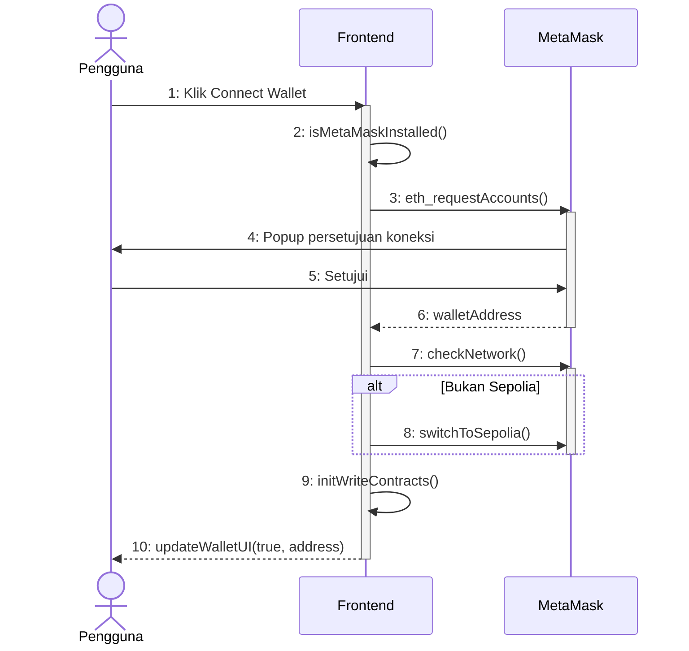
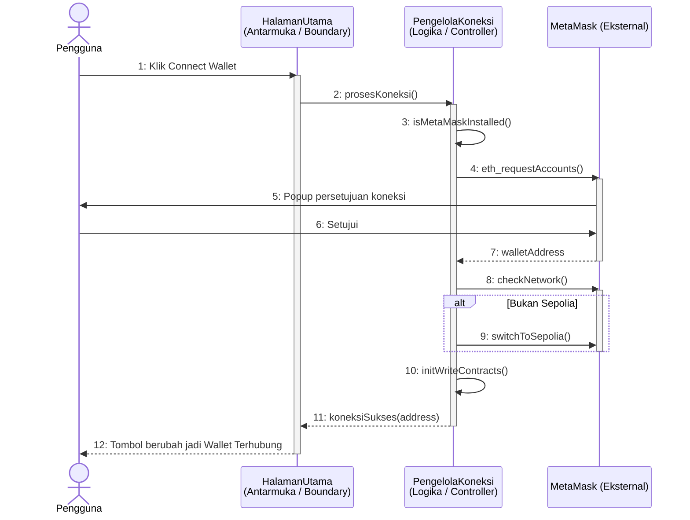
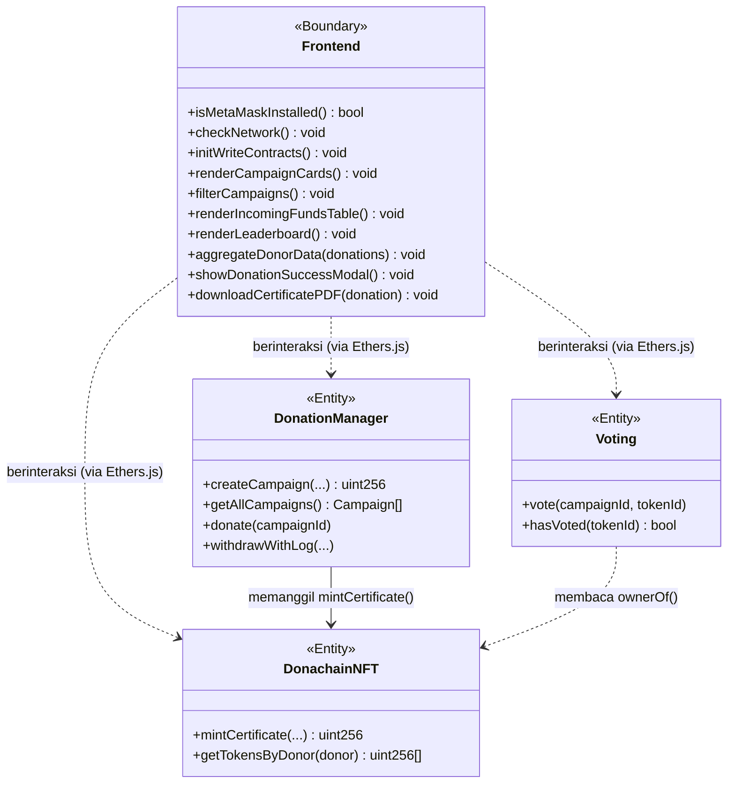
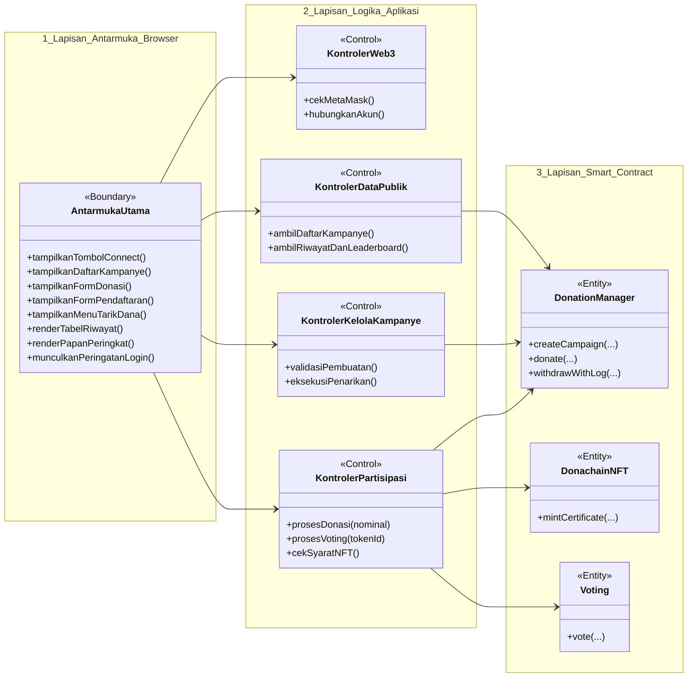
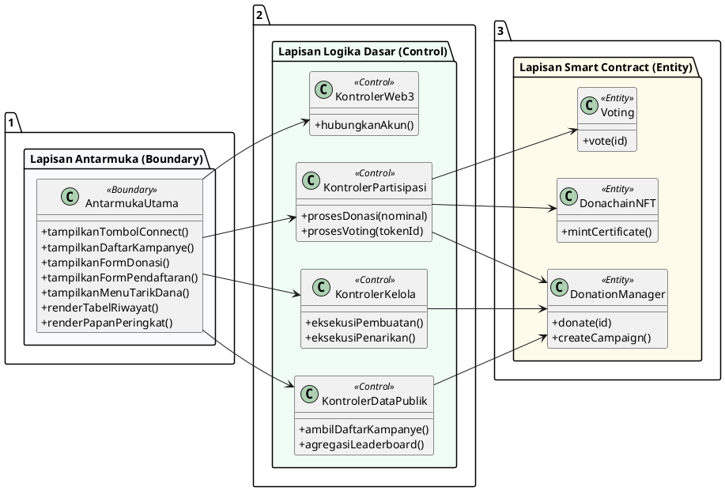
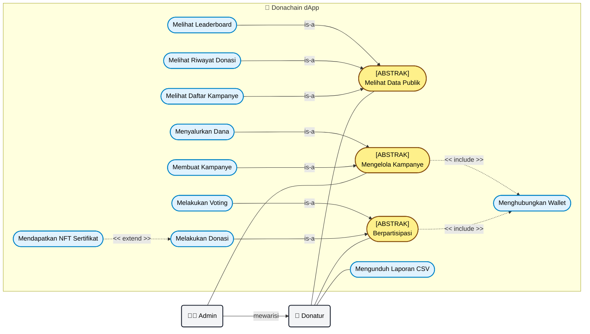
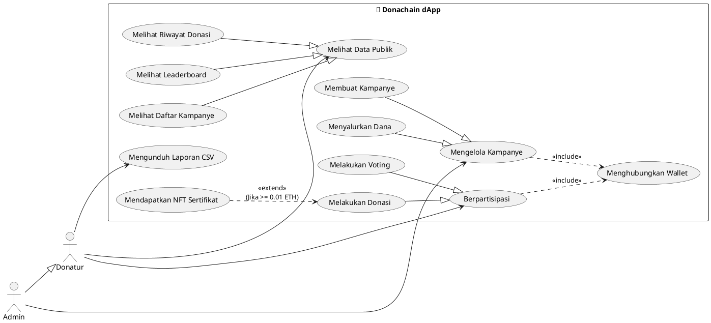

# Demonstrasi Perbedaan Pola Sequence Diagram

Dokumen ini mendemonstrasikan secara visual perbedaan antara diagram asli (monolith) dengan diagram yang sudah dipecah menggunakan prinsip **Boundary-Control-Entity (BCE)** ala buku teori Rekayasa Perangkat Lunak.

---

### Versi Asli (Saat Ini Diterapkan di 9 File)

Pada versi ini, seluruh urusan "tampilan" dan "logika kode" ditekan masuk ke dalam **satu *lifeline* tunggal bernama Frontend**. Singkat, hemat tempat, namun secara teknis kurang riil.

---

### Versi Baru (Jika Menggunakan Pola Detail BCE)

Pada versi ini, Frontend dipecah sesuai tanggung jawabnya (*Single Responsibility Principle*). Ada yang murni mengurus tampilan UI saja (seperti **HalamanUtama**), dan ada yang murni mengurus sistem penarikan data dari backend (seperti **PengelolaKoneksi**).

Versi diagram seperti ini yang sangat diidam-idamkan oleh dosen penguji atau reviewer jurnal.

---

**Analisis:**
Perhatikan perbedaannya: fungsi berat seperti `isMetaMaskInstalled()` sudah tidak dieksekusi di *HalamanUtama*, melainkan dititipkan ke *PengelolaKoneksi*. Ini membuktikan kodemu tidak numpuk "kotor" di berkas tampilan HTML/UI.

---

### Keselarasan dengan Class Diagram

Dengan mempertahankan gaya *Use Case* dan *Sequence Diagram* aslimu (di mana antarmuka sistem diwakili secara tunggal), maka **Class Diagram** yang mendampinginya akan berbentuk sangat kokoh dan kohesif. Seluruh fungsionalitas antarmuka dari segala penjuru (*connect wallet*, *render*, *download* PDF) akan dibungkus utuh ke dalam Class `Frontend` yang berperan sebagai *Boundary*, lalu berkomunikasi dengan Class *Smart Contract* di belakangnya (*Entity*).

*(Catatan: Class Diagram di atas hanya menampilkan kerangka utamanya saja. Untuk struktur detail seperti `Ownable`, pewarisan `ERC721`, serta struktur data `Struct` bisa dirujuk ke tabel detail di dalam bab dokumentasi kelasmu).*

---

### Versi Pamungkas (Full BCE: Boundary - Control - Entity)

Jika kamu ingin menerapkan pola yang kita diskusikan (memecah UI murni berisi tombol/form, dan *Controller* yang berisi logika Use Case), maka wujud Class Diagramnya akan sangat detail dan profesional seperti ini. 

Diagram ini membagi lurus alirannya dari Kiri ke Kanan: **Antarmuka (B) ➔ Logika (C) ➔ Smart Contract (E)**.

Versi kode **PlantUML**-nya:

---

### Demonstrasi Use Case Diagram (Dengan Generalisasi)

Kalau kamu mau menampilkan arsitektur yang kuat dan kokoh di bab Perancangan Sistem, **Use Case Diagram** ini memuat elemen advance seperti **Generalization (Pewarisan Aktor)**, **\<\<include\>\>** (syarat mutlak), dan **\<\<extend\>\>** (opsional bersyarat).

*(Diagram di bawah ini menampilkan ke-9 use case aslimu, tapi dikelompokkan ke induknya melalui relasi Generalisasi)*

Versi kode **PlantUML**-nya (dengan panah Generalization segitiga utuh `---|>`) :

**Kelebihan Menggunakan Gaya Buku Ini:**
Jumlah bulatan (_use case_) berkurang drastis dari 9 menjadi hanya 6. Gambar jadi jauh lebih *"clean"*, sangat mudah untuk dijelaskan di seminar sidang, dan memberikan ilusi sistem yang padat/kompak!

**Penjelasan Mengapa Dosen Pasti Suka:**
1. **Generalization (`--|>`):** Menunjukkan bahwa **Admin** terhubung dengan/mewarisi relasi **Donatur**. Artinya, Admin berhak melihat halaman riwayat dan daftar kampanye tanpa harus kita tarik banyak garis ruwet dari Admin ke Use Case tersebut (kemampuan itu menurun secara otomatis). Konsep OOP teraplikasi di diagram!
2. **\<\<Include\>\>:** Menggambarkan syarat mutlak. Orang mau berdonasi atau Admin mau membuat kampanye? Wajib melewati portal *Menghubungkan Wallet*.
3. **\<\<Extend\>\>:** Sangat detail. Sistem tidak semena-mena memberi NFT. Hanya kalau donasi mencapai *"Threshold"* tertentu maka fungsionalitas pencetakan tereksekusi.
