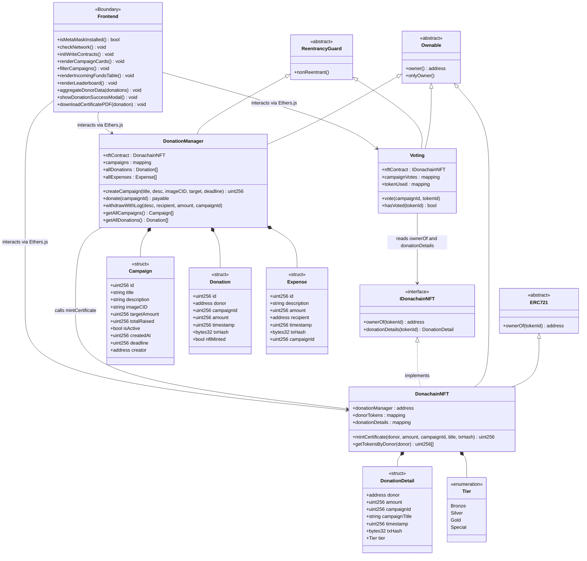

# Class Diagram — Donachain dApp

## Diagram (Versi Medium)

---

## Tabel Ringkasan Fungsi Utama Smart Contract

Tabel di bawah ini merangkum 9 method inti yang dieksekusi dalam alur kerja (Sequence Diagram) keseluruhan platform Donachain.

| No | Nama Fungsi | Parameter | Return | Akses (Modifier) | Deskripsi |
|----|---|---|---|---|---|
| 1 | `createCampaign()` | `title` (string), `desc` (string), `imageCID` (string), `target` (uint256), `deadline` (uint256) | `uint256` | public, `onlyOwner` | Membuat kampanye baru dan mengembalikan ID kampanye. |
| 2 | `donate()` | `campaignId` (uint256) | — | public, `payable` | Menerima dana donasi pengguna dan otomatis memicu pencetakan NFT (jika syarat tier terpenuhi). |
| 3 | `withdrawWithLog()` | `desc` (string), `recipient` (address), `amount` (uint256), `campaignId` (uint256) | — | public, `onlyOwner` | Menarik dana dari kontrak ke dompet tujuan dengan mencatatnya sebagai riwayat pengeluaran. |
| 4 | `getAllCampaigns()` | — | `Campaign[]` | public, view | Mengambil dan menampilkan seluruh daftar kampanye yang ada di platform. |
| 5 | `getAllDonations()` | — | `Donation[]` | public, view | Mengambil seluruh riwayat transaksi donasi untuk transparansi & leaderboard. |
| 6 | `mintCertificate()` | `donor` (address), `amount` (uint256), `campaignId` (uint256), `title` (string), `txHash` (bytes32) | `uint256` | public, `onlyDonationManager` | Mencetak NFT bukti donasi dan menentukannya ke tier tertentu. |
| 7 | `getTokensByDonor()` | `donor` (address) | `uint256[]` | public, view | Mendapatkan daftar ID NFT yang dimiliki oleh alamat donatur tertentu. |
| 8 | `vote()` | `campaignId` (uint256), `tokenId` (uint256) | — | public | Memberikan dukungan (vote) ke kampanye menggunakan satu token NFT. |
| 9 | `hasVoted()` | `tokenId` (uint256) | `bool` | public, view | Mengecek apakah sebuah token NFT sudah pernah digunakan untuk fitur voting. |

---

## Tabel Detail Tiap Class / Struktur Data

### 1. DonationManager

**Stereotype:** Ownable, ReentrancyGuard

| No | Nama Atribut | Tipe Data | Visibility | Keterangan |
|----|---|---|---|---|
| 1 | nftContract | DonachainNFT | public | Referensi ke kontrak NFT |
| 2 | campaigns | mapping(uint256 => Campaign) | public | Pemetaan ID ke data kampanye |
| 3 | allDonations | Donation[] | public | Daftar semua donasi |
| 4 | allExpenses | Expense[] | public | Daftar semua pengeluaran |

| No | Nama Method | Parameter | Return | Visibility | Keterangan |
|----|---|---|---|---|---|
| 1 | createCampaign | string title, string description, string imageCID, uint256 targetAmount, uint256 deadline | uint256 | public | Buat kampanye baru |
| 2 | donate | uint256 campaignId | — | public | Terima donasi + mint NFT |
| 3 | withdrawWithLog | string description, address recipient, uint256 amount, uint256 campaignId | — | public | Tarik dana + catat pengeluaran |
| 4 | getAllCampaigns | — | Campaign[] | public | Ambil semua kampanye |
| 5 | getAllDonations | — | Donation[] | public | Ambil semua donasi |

| No | Relasi | Tipe Relasi | Ke Class | Keterangan |
|----|---|---|---|---|
| 1 | Inheritance | Generalization | Ownable | Mewarisi fitur akses kontrol (onlyOwner) |
| 2 | Inheritance | Generalization | ReentrancyGuard | Mewarisi proteksi reentrancy (nonReentrant) |
| 3 | Composition | Composition | Campaign | Memiliki dan mengelola data kampanye |
| 4 | Composition | Composition | Donation | Memiliki dan mengelola data donasi |
| 5 | Composition | Composition | Expense | Memiliki dan mengelola data pengeluaran |
| 6 | Association | Dependency | DonachainNFT | Memanggil mintCertificate() saat donasi ≥ 0.01 ETH |

---

### 2. DonachainNFT

**Stereotype:** ERC721, ERC721URIStorage, Ownable

| No | Nama Atribut | Tipe Data | Visibility | Keterangan |
|----|---|---|---|---|
| 1 | donationManager | address | public | Alamat kontrak DonationManager |
| 2 | donorTokens | mapping(address => uint256[]) | public | Daftar token per donatur |
| 3 | donationDetails | mapping(uint256 => DonationDetail) | public | Detail donasi per token |

| No | Nama Method | Parameter | Return | Visibility | Keterangan |
|----|---|---|---|---|---|
| 1 | mintCertificate | address donor, uint256 amount, uint256 campaignId, string campaignTitle, bytes32 txHash | uint256 | public | Mint NFT sertifikat donasi |
| 2 | getTokensByDonor | address donor | uint256[] | public | Ambil token milik donatur |

| No | Relasi | Tipe Relasi | Ke Class | Keterangan |
|----|---|---|---|---|
| 1 | Inheritance | Generalization | ERC721 | Mewarisi standar token NFT (ERC-721) |
| 2 | Inheritance | Generalization | Ownable | Mewarisi fitur akses kontrol (onlyOwner) |
| 3 | Realization | Interface Realization | IDonachainNFT | Mengimplementasikan interface IDonachainNFT |
| 4 | Composition | Composition | DonationDetail | Memiliki dan mengelola detail donasi per NFT |
| 5 | Composition | Composition | Tier | Menggunakan enum Tier untuk klasifikasi NFT |

---

### 3. Voting

**Stereotype:** Ownable, ReentrancyGuard

| No | Nama Atribut | Tipe Data | Visibility | Keterangan |
|----|---|---|---|---|
| 1 | nftContract | IDonachainNFT | public | Referensi ke interface NFT |
| 2 | campaignVotes | mapping(uint256 => uint256) | public | Jumlah vote per kampanye |
| 3 | tokenUsed | mapping(uint256 => bool) | public | Status NFT sudah digunakan vote |

| No | Nama Method | Parameter | Return | Visibility | Keterangan |
|----|---|---|---|---|---|
| 1 | vote | uint256 campaignId, uint256 tokenId | — | public | Voting menggunakan NFT sebagai tiket |
| 2 | hasVoted | uint256 tokenId | bool | public | Cek apakah NFT sudah dipakai vote |

| No | Relasi | Tipe Relasi | Ke Class | Keterangan |
|----|---|---|---|---|
| 1 | Inheritance | Generalization | Ownable | Mewarisi fitur akses kontrol (onlyOwner) |
| 2 | Inheritance | Generalization | ReentrancyGuard | Mewarisi proteksi reentrancy (nonReentrant) |
| 3 | Association | Dependency | DonachainNFT (via IDonachainNFT) | Membaca ownerOf() dan donationDetails() untuk validasi vote |

---

### 4. Frontend

**Stereotype:** Boundary / UI Context

| No | Nama Method | Parameter | Return | Keterangan |
|----|---|---|---|---|
| 1 | `isMetaMaskInstalled` | — | `bool` | Memeriksa apakah ekstensi dompet Web3 terinstal |
| 2 | `checkNetwork` | — | `void` | Memastikan pengguna berada di jaringan Sepolia |
| 3 | `initWriteContracts` | — | `void` | Melakukan inisiasi _signer_ ke Smart Contract |
| 4 | `renderCampaignCards` | — | `void` | Menampilkan data kampanye ke UI bentuk kartu |
| 5 | `filterCampaigns` | — | `void` | Menyortir kampanye berdasarkan input pengguna |
| 6 | `renderIncomingFundsTable`| — | `void` | Merender riwayat donasi ke tabel transparansi |
| 7 | `renderLeaderboard` | — | `void` | Merender daftar peringkat donatur |
| 8 | `aggregateDonorData` | `donations` | `void` | Menjumlahkan total donasi untuk setiap donatur unik |
| 9 | `showDonationSuccessModal`| — | `void` | Menampilkan GUI konfirmasi sukses donasi |
| 10 | `downloadCertificatePDF` | `donation` | `void` | Menjalankan *jsPDF* untuk mencetak sertifikat lokal |

| No | Relasi | Tipe Relasi | Ke Class | Keterangan |
|----|---|---|---|---|
| 1 | Association | Dependency | DonationManager | Berinteraksi via Ethers.js |
| 2 | Association | Dependency | DonachainNFT | Berinteraksi via Ethers.js |
| 3 | Association | Dependency | Voting | Berinteraksi via Ethers.js |

---

### 5. Campaign (Struct)

| No | Nama Atribut | Tipe Data | Keterangan |
|----|---|---|---|
| 1 | id | uint256 | Identifier unik kampanye |
| 2 | title | string | Judul kampanye |
| 3 | description | string | Deskripsi lengkap kampanye |
| 4 | imageCID | string | IPFS Content ID untuk gambar kampanye |
| 5 | targetAmount | uint256 | Target dana yang ingin dicapai (dalam wei) |
| 6 | totalRaised | uint256 | Total dana yang sudah terkumpul |
| 7 | isActive | bool | Status aktif kampanye |
| 8 | createdAt | uint256 | Timestamp pembuatan kampanye |
| 9 | deadline | uint256 | Timestamp batas waktu kampanye |
| 10 | creator | address | Alamat pembuat kampanye |

| No | Relasi | Tipe Relasi | Ke Class | Keterangan |
|----|---|---|---|---|
| 1 | Composition | Part-of | DonationManager | Dimiliki oleh DonationManager |

---

### 5. Donation (Struct)

| No | Nama Atribut | Tipe Data | Keterangan |
|----|---|---|---|
| 1 | id | uint256 | Identifier unik donasi |
| 2 | donor | address | Alamat donatur |
| 3 | campaignId | uint256 | ID kampanye yang didonasikan |
| 4 | amount | uint256 | Jumlah donasi dalam wei |
| 5 | timestamp | uint256 | Waktu donasi |
| 6 | txHash | bytes32 | Hash transaksi donasi |
| 7 | nftMinted | bool | Status apakah NFT sudah di-mint |

| No | Relasi | Tipe Relasi | Ke Class | Keterangan |
|----|---|---|---|---|
| 1 | Composition | Part-of | DonationManager | Dimiliki oleh DonationManager |

---

### 6. Expense (Struct)

| No | Nama Atribut | Tipe Data | Keterangan |
|----|---|---|---|
| 1 | id | uint256 | Identifier unik pengeluaran |
| 2 | description | string | Deskripsi pengeluaran |
| 3 | amount | uint256 | Jumlah pengeluaran dalam wei |
| 4 | recipient | address | Alamat penerima dana |
| 5 | timestamp | uint256 | Waktu pengeluaran |
| 6 | txHash | bytes32 | Hash transaksi penarikan |
| 7 | campaignId | uint256 | ID kampanye terkait |

| No | Relasi | Tipe Relasi | Ke Class | Keterangan |
|----|---|---|---|---|
| 1 | Composition | Part-of | DonationManager | Dimiliki oleh DonationManager |

---

### 7. DonationDetail (Struct)

| No | Nama Atribut | Tipe Data | Keterangan |
|----|---|---|---|
| 1 | donor | address | Alamat donatur |
| 2 | amount | uint256 | Jumlah donasi dalam wei |
| 3 | campaignId | uint256 | ID kampanye |
| 4 | campaignTitle | string | Judul kampanye |
| 5 | timestamp | uint256 | Waktu donasi |
| 6 | txHash | bytes32 | Hash transaksi donasi |
| 7 | tier | Tier | Tier NFT (Bronze/Silver/Gold/Special) |

| No | Relasi | Tipe Relasi | Ke Class | Keterangan |
|----|---|---|---|---|
| 1 | Composition | Part-of | DonachainNFT | Dimiliki oleh DonachainNFT |

---

### 8. Tier (Enumeration)

| No | Nilai | Keterangan |
|----|---|---|
| 1 | Bronze | Tier dasar (donasi 0.01–0.049 ETH) |
| 2 | Silver | Tier menengah (donasi 0.05–0.099 ETH) |
| 3 | Gold | Tier tinggi (donasi ≥ 0.1 ETH) |
| 4 | Special | Tier spesial (1–5% random chance) |

| No | Relasi | Tipe Relasi | Ke Class | Keterangan |
|----|---|---|---|---|
| 1 | Composition | Part-of | DonachainNFT | Digunakan oleh DonachainNFT untuk klasifikasi tier |

---

## Ringkasan Seluruh Relasi

| No | Dari | Ke | Tipe Relasi | Keterangan |
|----|---|---|---|---|
| 1 | DonationManager | Ownable | Generalization | Mewarisi akses kontrol |
| 2 | DonationManager | ReentrancyGuard | Generalization | Mewarisi proteksi reentrancy |
| 3 | DonationManager | Campaign | Composition | Memiliki data kampanye |
| 4 | DonationManager | Donation | Composition | Memiliki data donasi |
| 5 | DonationManager | Expense | Composition | Memiliki data pengeluaran |
| 6 | DonationManager | DonachainNFT | Dependency | Memanggil mintCertificate() |
| 7 | DonachainNFT | ERC721 | Generalization | Mewarisi standar NFT |
| 8 | DonachainNFT | Ownable | Generalization | Mewarisi akses kontrol |
| 9 | DonachainNFT | IDonachainNFT | Realization | Mengimplementasikan interface |
| 10 | DonachainNFT | DonationDetail | Composition | Memiliki detail donasi per NFT |
| 11 | DonachainNFT | Tier | Composition | Menggunakan enum tier |
| 12 | Voting | Ownable | Generalization | Mewarisi akses kontrol |
| 13 | Voting | ReentrancyGuard | Generalization | Mewarisi proteksi reentrancy |
| 14 | Voting | DonachainNFT | Dependency | Membaca ownerOf() & donationDetails() |
| 15 | Frontend | DonationManager | Dependency | Berinteraksi lewat Ethers.js |
| 16 | Frontend | DonachainNFT | Dependency | Berinteraksi lewat Ethers.js |
| 17 | Frontend | Voting | Dependency | Berinteraksi lewat Ethers.js |

---

## Daftar File Diagram

| Versi | PlantUML | Mermaid | Isi |
|---|---|---|---|
| ⭐ **Medium** | [class_diagram_medium.puml](file:///d:/Aplikasi%20Buatanku/donachain/diagrams/plantuml/class_diagram_medium.puml) | — | Methods + parameter, inheritance arrows, OpenZeppelin ringkas |
| **Ringkas** | [class_diagram_simple.puml](file:///d:/Aplikasi%20Buatanku/donachain/diagrams/plantuml/class_diagram_simple.puml) | [class_diagram_simple.mmd](file:///d:/Aplikasi%20Buatanku/donachain/diagrams/class_diagram_simple.mmd) | Stereotype saja, tanpa panah inheritance |
| **Detail** | [class_diagram.puml](file:///d:/Aplikasi%20Buatanku/donachain/diagrams/plantuml/class_diagram.puml) | [class_diagram.mmd](file:///d:/Aplikasi%20Buatanku/donachain/diagrams/class_diagram.mmd) | Semua atribut, parameter, base class lengkap |

> [!IMPORTANT]
> **Rekomendasi untuk skripsi:** Gunakan versi **Medium** (`class_diagram_medium.puml`). Versi ini memenuhi permintaan dosen: ada **methods dengan parameter**, **panah inheritance ke OpenZeppelin**, **composition**, dan **dependency** — tapi tetap terbaca karena OpenZeppelin-nya disederhanakan.
