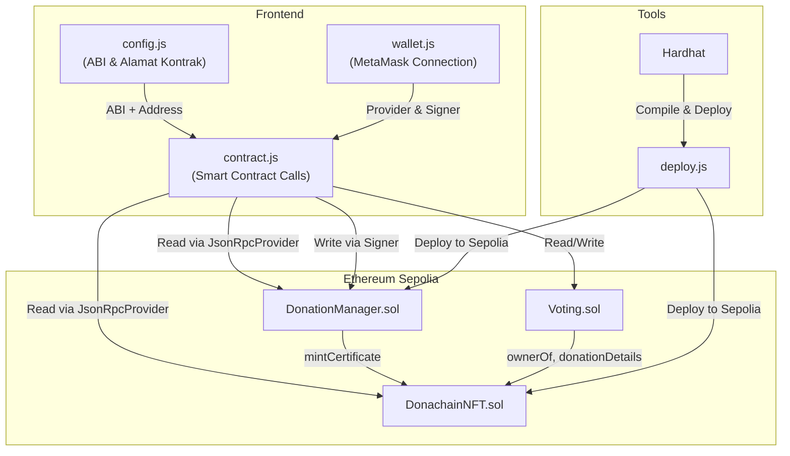
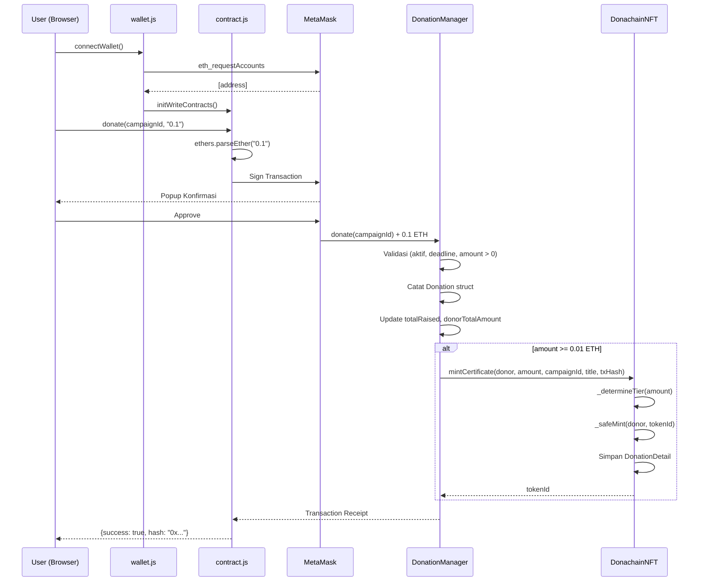

# Dokumentasi Implementasi Smart Contract Donachain

Dokumen ini menjelaskan implementasi kode yang berkaitan dengan smart contract pada platform Donachain, mencakup konfigurasi, deployment, dan integrasi frontend.

---

## 1. Konfigurasi Development Environment

### 1.1 Hardhat Configuration — [hardhat.config.js](file:///d:/Aplikasi%20Buatanku/donachain/hardhat.config.js)

| No  | Komponen         | Konfigurasi                        | Keterangan                                                   |
| --- | ---------------- | ---------------------------------- | ------------------------------------------------------------ |
| 1   | Solidity Version | `0.8.20`                           | Versi compiler Solidity yang digunakan                       |
| 2   | Optimizer        | Enabled, `200 runs`                | Mengoptimalkan bytecode untuk efisiensi gas                  |
| 3   | viaIR            | `true`                             | Menggunakan pipeline IR Solidity untuk optimasi lebih lanjut |
| 4   | Network Sepolia  | `https://sepolia.infura.io/v3/...` | RPC endpoint menggunakan layanan Infura                      |
| 5   | Hardhat Local    | Chain ID `31337`                   | Jaringan lokal untuk pengujian                               |
| 6   | Etherscan API    | Dari `.env`                        | Untuk verifikasi kontrak di Etherscan                        |

### 1.2 Dependensi Utama — [package.json](file:///d:/Aplikasi%20Buatanku/donachain/package.json)

| No  | Package                            | Kegunaan                                                 |
| --- | ---------------------------------- | -------------------------------------------------------- |
| 1   | `hardhat`                          | Framework development & testing smart contract           |
| 2   | `@nomicfoundation/hardhat-toolbox` | Plugin lengkap (ethers, chai, gas reporter, dll.)        |
| 3   | `@openzeppelin/contracts`          | Library standar untuk ERC-721, Ownable, ReentrancyGuard  |
| 4   | `dotenv`                           | Manajemen environment variables (API keys, private keys) |

---

## 2. Implementasi Smart Contract

### 2.1 DonationManager.sol — [Source Code](file:///d:/Aplikasi%20Buatanku/donachain/contracts/DonationManager.sol)

| No  | Aspek            | Detail Implementasi                                                      |
| --- | ---------------- | ------------------------------------------------------------------------ |
| 1   | Inheritance      | `Ownable` (kontrol akses admin), `ReentrancyGuard` (keamanan reentrancy) |
| 2   | Solidity Version | `^0.8.20` (menggunakan fitur-fitur terbaru)                              |
| 3   | Total Baris Kode | 514 baris                                                                |
| 4   | Jumlah Struct    | 3 (Campaign, Donation, Expense)                                          |
| 5   | Jumlah Mapping   | 6 mapping untuk penyimpanan data                                         |
| 6   | Jumlah Fungsi    | 15 fungsi (4 admin, 1 publik, 10 view)                                   |
| 7   | Jumlah Event     | 4 event untuk tracking transaksi                                         |
| 8   | Integrasi NFT    | Otomatis mint sertifikat saat donasi ≥ 0.01 ETH                          |

#### Mekanisme Inti

| No  | Mekanisme             | Penjelasan                                                                                                                                                                              |
| --- | --------------------- | --------------------------------------------------------------------------------------------------------------------------------------------------------------------------------------- |
| 1   | **Donasi**            | Donatur memanggil `donate(campaignId)` dengan mengirimkan ETH. Kontrak memvalidasi kampanye aktif, deadline belum lewat, lalu mencatat donasi dan otomatis mencetak NFT jika ≥ 0.01 ETH |
| 2   | **Penarikan Dana**    | Admin memanggil `withdrawWithLog()` yang menggabungkan pencatatan pengeluaran dan transfer dana dalam satu transaksi atomik                                                             |
| 3   | **Deadline Kampanye** | Setiap kampanye memiliki `deadline` (Unix timestamp). Donasi ditolak jika `block.timestamp > deadline`                                                                                  |
| 4   | **Leaderboard**       | Fungsi `getLeaderboard()` mengurutkan donatur unik berdasarkan total akumulasi donasi menggunakan bubble sort on-chain                                                                  |
| 5   | **Keamanan**          | `nonReentrant` pada fungsi `donate()` dan `withdrawWithLog()` mencegah serangan reentrancy                                                                                              |

---

### 2.2 DonachainNFT.sol — [Source Code](file:///d:/Aplikasi%20Buatanku/donachain/contracts/DonachainNFT.sol)

| No  | Aspek              | Detail Implementasi                     |
| --- | ------------------ | --------------------------------------- |
| 1   | Standar Token      | ERC-721 (Non-Fungible Token)            |
| 2   | Inheritance        | `ERC721`, `ERC721URIStorage`, `Ownable` |
| 3   | Total Baris Kode   | 405 baris                               |
| 4   | Nama Token         | "Donachain Impact Certificate"          |
| 5   | Symbol Token       | "DONATE"                                |
| 6   | Jumlah Tier        | 4 (Bronze, Silver, Gold, Special)       |
| 7   | Penyimpanan Gambar | IPFS (via Pinata Gateway)               |
| 8   | Metadata           | On-chain (Base64-encoded JSON)          |

#### Sistem Tier NFT

| No  | Tier    | Rentang Donasi   | Mekanisme                                        | CID Gambar      |
| --- | ------- | ---------------- | ------------------------------------------------ | --------------- |
| 1   | Bronze  | 0.01 – 0.049 ETH | Berdasarkan jumlah donasi                        | `bafybeifcs...` |
| 2   | Silver  | 0.05 – 0.099 ETH | Berdasarkan jumlah donasi                        | `bafkreif7f...` |
| 3   | Gold    | ≥ 0.1 ETH        | Berdasarkan jumlah donasi                        | `bafybeigxq...` |
| 4   | Special | Semua jumlah     | 5% probabilitas acak (`random < 500` dari 10000) | `bafybeigb7...` |

#### Mekanisme Metadata On-Chain

| No  | Komponen Metadata | Sumber                      | Keterangan                                 |
| --- | ----------------- | --------------------------- | ------------------------------------------ |
| 1   | `name`            | Gabungan tokenId + tierName | Contoh: "Donachain Certificate #1 (Gold)"  |
| 2   | `description`     | Template + tierName         | Deskripsi otomatis berdasarkan tier        |
| 3   | `image`           | IPFS CID berdasarkan tier   | Format: `ipfs://{CID}`                     |
| 4   | `attributes`      | DonationDetail struct       | Tier, Campaign, Amount, Campaign ID, Date  |
| 5   | Encoding          | Base64 JSON                 | Format: `data:application/json;base64,...` |

#### Pseudo-Random Number Generation

| No  | Komponen           | Kegunaan                                                |
| --- | ------------------ | ------------------------------------------------------- |
| 1   | `block.timestamp`  | Waktu blok saat transaksi                               |
| 2   | `block.prevrandao` | Random beacon dari konsensus Ethereum                   |
| 3   | `donor` address    | Alamat donatur sebagai entropi tambahan                 |
| 4   | `tokenId`          | ID token sebagai variasi                                |
| 5   | `_randomNonce`     | Counter yang selalu bertambah untuk mencegah hasil sama |

---

### 2.3 Voting.sol — [Source Code](file:///d:/Aplikasi%20Buatanku/donachain/contracts/Voting.sol)

| No  | Aspek            | Detail Implementasi                               |
| --- | ---------------- | ------------------------------------------------- |
| 1   | Inheritance      | `Ownable`, `ReentrancyGuard`                      |
| 2   | Total Baris Kode | 119 baris                                         |
| 3   | Mekanisme Voting | NFT sebagai "tiket" voting                        |
| 4   | Aturan           | 1 NFT = 1 vote, NFT harus dari kampanye yang sama |

#### Alur Voting

| No  | Langkah           | Validasi                              | Keterangan                                       |
| --- | ----------------- | ------------------------------------- | ------------------------------------------------ |
| 1   | Cek Kepemilikan   | `ownerOf(tokenId) == msg.sender`      | Pemanggil harus pemilik NFT                      |
| 2   | Cek Status NFT    | `!tokenUsed[tokenId]`                 | NFT belum pernah dipakai voting                  |
| 3   | Validasi Kampanye | `nftCampaignId == campaignId`         | NFT harus berasal dari donasi kampanye yang sama |
| 4   | Eksekusi          | `tokenUsed = true`, `campaignVotes++` | Tandai NFT sudah dipakai dan tambah jumlah vote  |

---

## 3. Implementasi Deployment

### 3.1 Deploy Utama — [deploy.js](file:///d:/Aplikasi%20Buatanku/donachain/scripts/deploy.js)

| No  | Step                   | Aksi                                             | Keterangan                                    |
| --- | ---------------------- | ------------------------------------------------ | --------------------------------------------- |
| 1   | Persiapan              | Ambil deployer account & cek balance             | Memastikan deployer punya cukup ETH untuk gas |
| 2   | Deploy DonachainNFT    | `DonachainNFT.deploy(deployer.address)`          | Deploy kontrak NFT dengan admin = deployer    |
| 3   | Deploy DonationManager | `DonationManager.deploy(deployer.address)`       | Deploy kontrak utama donasi                   |
| 4   | Koneksi NFT → Manager  | `nftContract.setDonationManager(managerAddress)` | Mengizinkan DonationManager untuk minting NFT |
| 5   | Koneksi Manager → NFT  | `donationManager.setNFTContract(nftAddress)`     | DonationManager tahu alamat kontrak NFT       |
| 6   | Simpan Alamat          | Tulis ke `deployment-info.json`                  | Menyimpan alamat kontrak untuk referensi      |

### 3.2 Deploy Voting — [deploy_voting.js](file:///d:/Aplikasi%20Buatanku/donachain/scripts/deploy_voting.js)

| No  | Step           | Aksi                                  | Keterangan                               |
| --- | -------------- | ------------------------------------- | ---------------------------------------- |
| 1   | Set Alamat NFT | Hardcoded `0x18F2DaF...`              | Alamat DonachainNFT yang sudah di-deploy |
| 2   | Deploy Voting  | `Voting.deploy(NFT_CONTRACT_ADDRESS)` | Deploy dengan referensi ke kontrak NFT   |

### 3.3 Hasil Deployment (Sepolia Testnet)

| No  | Kontrak         | Alamat                                       | Etherscan                                                                                |
| --- | --------------- | -------------------------------------------- | ---------------------------------------------------------------------------------------- |
| 1   | DonachainNFT    | `0x18F2DaF080C9FeD516a1bAf2f44EC6dffe258100` | [Lihat](https://sepolia.etherscan.io/address/0x18F2DaF080C9FeD516a1bAf2f44EC6dffe258100) |
| 2   | DonationManager | `0x6cE174d0c343cCbD0152A431645F9ec31aFA1BeF` | [Lihat](https://sepolia.etherscan.io/address/0x6cE174d0c343cCbD0152A431645F9ec31aFA1BeF) |
| 3   | Voting          | `0x0767723b505C88D4beF91106C1dB6bAd1b55aa8c` | [Lihat](https://sepolia.etherscan.io/address/0x0767723b505C88D4beF91106C1dB6bAd1b55aa8c) |
| 4   | Admin           | `0xEaEdf9E1175E6CA7B7F400e3fAaC1D3dE2F7Fe0e` | —                                                                                        |

---

## 4. Implementasi Integrasi Frontend

### 4.1 Modul Konfigurasi — [config.js](file:///d:/Aplikasi%20Buatanku/donachain/frontend/js/config.js)

File ini menyimpan alamat kontrak yang sudah di-deploy, ABI (Application Binary Interface) untuk ketiga kontrak, konfigurasi jaringan Sepolia, dan URL gateway IPFS Pinata.

### 4.2 Modul Wallet — [wallet.js](file:///d:/Aplikasi%20Buatanku/donachain/frontend/js/wallet.js)

Modul ini mengelola koneksi MetaMask, validasi jaringan Sepolia, dan penanganan perubahan akun/jaringan. Fungsi inti:

| No  | Fungsi               | Keterangan                                                                                                 |
| --- | -------------------- | ---------------------------------------------------------------------------------------------------------- |
| 1   | `connectWallet()`    | Menghubungkan ke MetaMask via `eth_requestAccounts`, membuat `BrowserProvider` dan `Signer` dari ethers.js |
| 2   | `disconnectWallet()` | Mereset state wallet dan menghapus data localStorage                                                       |
| 3   | `switchToSepolia()`  | Meminta user switch jaringan; jika belum ada, otomatis menambahkan via `wallet_addEthereumChain`           |

### 4.3 Modul Kontrak — [contract.js](file:///d:/Aplikasi%20Buatanku/donachain/frontend/js/contract.js)

Modul ini menangani semua interaksi dengan smart contract. Kontrak read menggunakan `JsonRpcProvider` publik (tanpa wallet), sedangkan kontrak write menggunakan `Signer` dari MetaMask.

#### Fungsi Inti — Read (Baca Data dari Blockchain)

| No  | Fungsi Frontend         | Fungsi Smart Contract                        | Keterangan                                              |
| --- | ----------------------- | -------------------------------------------- | ------------------------------------------------------- |
| 1   | `getCampaigns()`        | `getAllCampaigns()`                          | Mengambil seluruh data kampanye                         |
| 2   | `getActiveCampaigns()`  | `getActiveCampaigns()`                       | Mengambil kampanye yang aktif dan belum expired         |
| 3   | `getAllDonations()`     | `getAllDonations()` + event logs             | Mengambil seluruh donasi beserta txHash asli dari event |
| 4   | `getAllExpenses()`      | `getAllExpenses()` + event logs              | Mengambil seluruh pengeluaran beserta txHash            |
| 5   | `getLeaderboard(count)` | `getLeaderboard(count)`                      | Mengambil daftar top donatur                            |
| 6   | `getStats()`            | `getStats()`                                 | Mengambil statistik platform                            |
| 7   | `getNFTsByOwner(addr)`  | `getTokensByDonor()` + `getDonationDetail()` | Mengambil koleksi NFT milik donatur                     |
| 8   | `getCampaignVotes(id)`  | `getVotes(id)`                               | Mengambil jumlah vote kampanye                          |

#### Fungsi Inti — Write (Tulis Data ke Blockchain)

| No  | Fungsi Frontend                        | Fungsi Smart Contract                | Akses                | Keterangan                            |
| --- | -------------------------------------- | ------------------------------------ | -------------------- | ------------------------------------- |
| 1   | `donate(campaignId, amountEth)`        | `donate(campaignId)`                 | Publik               | Mengirim donasi ETH ke kampanye       |
| 2   | `createCampaign(...)`                  | `createCampaign(...)`                | Admin                | Membuat kampanye baru dengan deadline |
| 3   | `withdrawWithLog(...)`                 | `withdrawWithLog(...)`               | Admin                | Menarik dana + catat pengeluaran      |
| 4   | `updateCampaignStatus(id, isActive)`   | `updateCampaignStatus(id, isActive)` | Admin                | Mengubah status aktif kampanye        |
| 5   | `voteForCampaign(campaignId, tokenId)` | `vote(campaignId, tokenId)`          | Publik (pemilik NFT) | Voting menggunakan NFT sebagai tiket  |

---

## 5. Arsitektur Integrasi

### Diagram Alur Interaksi Keseluruhan

### Alur Proses Donasi (End-to-End)

