# Dokumentasi Use Case, Activity & Sequence Diagram — Donachain dApp

Dokumentasi ini berisi **Use Case Diagram**, **Activity Diagram** (swimlane User | System), dan **Sequence Diagram** untuk 9 use case utama platform **Donachain**.

---

## Use Case Diagram

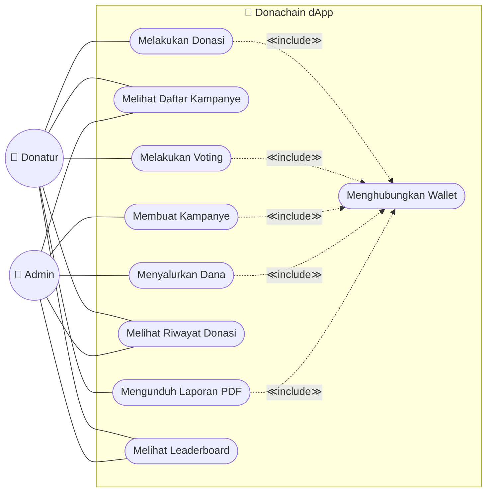
```mermaid
flowchart LR
    Donatur(("👤 Donatur"))
    Admin(("👤 Admin"))

    subgraph System["🔷 Donachain dApp"]
        UC1([Menghubungkan Wallet])
        UC2([Membuat Kampanye])
        UC3([Melihat Daftar Kampanye])
        UC4([Melakukan Donasi])
        UC5([Melakukan Voting])
        UC6([Menyalurkan Dana])
        UC7([Melihat Riwayat Donasi])
        UC8([Mengunduh Laporan PDF])
        UC9([Melihat Leaderboard])
    end

    Donatur --- UC3
    Donatur --- UC4
    Donatur --- UC5
    Donatur --- UC7
    Donatur --- UC8
    Donatur --- UC9

    Admin --- UC2
    Admin --- UC3
    Admin --- UC6
    Admin --- UC7
    Admin --- UC9

    UC4 -.->|"≪include≫"| UC1
    UC5 -.->|"≪include≫"| UC1
    UC2 -.->|"≪include≫"| UC1
    UC6 -.->|"≪include≫"| UC1
    UC8 -.->|"≪include≫"| UC1
```

---

## Class Diagram Keseluruhan (Pemetaan Sequence)

> **[Paragraf Pengantar untuk Word]**
> Diagram kelas keseluruhan pada **Gambar [Nomor Gambar]** merangkum pemetaan fungsionalitas dari semua interaksi yang tertera pada *Sequence Diagram*. Diagram ini secara eksplisit membedakan lingkup komputasi antara klien (*Frontend* / Antarmuka), sistem pendukung, dan *backend* (*Smart Contracts* di Blockchain).

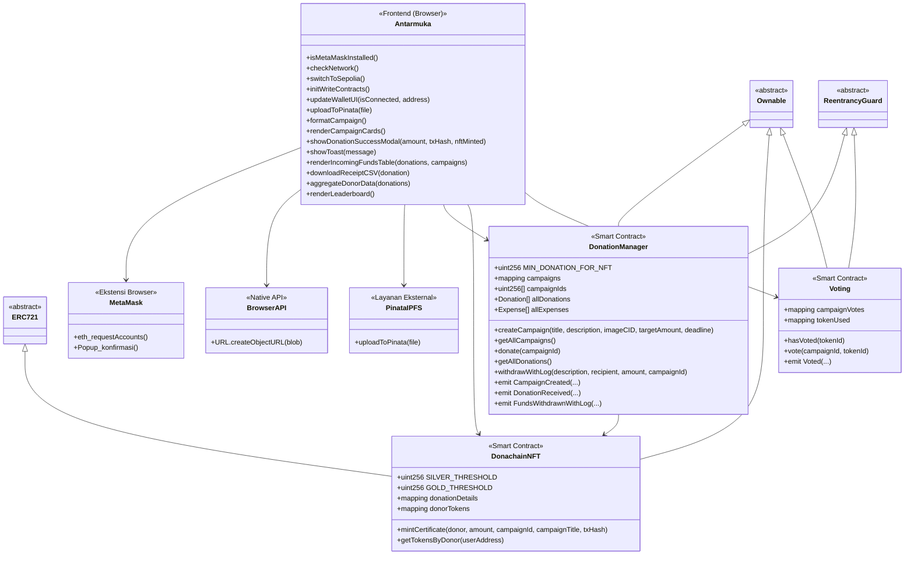
```mermaid
classDiagram
    %% Inheritance Base Contracts
    class Ownable { <<abstract>> }
    class ReentrancyGuard { <<abstract>> }
    class ERC721 { <<abstract>> }

    %% Frontend / Client-Side
    class Antarmuka {
        <<Frontend (Browser)>>
        +isMetaMaskInstalled()
        +checkNetwork()
        +switchToSepolia()
        +initWriteContracts()
        +updateWalletUI(isConnected, address)
        +uploadToPinata(file)
        +formatCampaign()
        +renderCampaignCards()
        +showDonationSuccessModal(amount, txHash, nftMinted)
        +showToast(message)
        +renderIncomingFundsTable(donations, campaigns)
        +downloadReceiptCSV(donation)
        +aggregateDonorData(donations)
        +renderLeaderboard()
    }

    class MetaMask {
        <<Ekstensi Browser>>
        +eth_requestAccounts()
        +Popup_konfirmasi()
    }

    class BrowserAPI {
        <<Native API>>
        +URL.createObjectURL(blob)
    }

    class PinataIPFS {
        <<Layanan Eksternal>>
        +uploadToPinata(file)
    }

    %% Backend / Blockchain
    class DonationManager {
        <<Smart Contract>>
        +uint256 MIN_DONATION_FOR_NFT
        +mapping campaigns
        +uint256[] campaignIds
        +Donation[] allDonations
        +Expense[] allExpenses
        +createCampaign(title, description, imageCID, targetAmount, deadline)
        +getAllCampaigns()
        +donate(campaignId)
        +getAllDonations()
        +withdrawWithLog(description, recipient, amount, campaignId)
        +emit CampaignCreated(...)
        +emit DonationReceived(...)
        +emit FundsWithdrawnWithLog(...)
    }

    class DonachainNFT {
        <<Smart Contract>>
        +uint256 SILVER_THRESHOLD
        +uint256 GOLD_THRESHOLD
        +mapping donationDetails
        +mapping donorTokens
        +mintCertificate(donor, amount, campaignId, campaignTitle, txHash)
        +getTokensByDonor(userAddress)
    }

    class Voting {
        <<Smart Contract>>
        +mapping campaignVotes
        +mapping tokenUsed
        +hasVoted(tokenId)
        +vote(campaignId, tokenId)
        +emit Voted(...)
    }

    %% Inheritance Relationships
    Ownable <|-- DonationManager
    ReentrancyGuard <|-- DonationManager
    ERC721 <|-- DonachainNFT
    Ownable <|-- DonachainNFT
    Ownable <|-- Voting
    ReentrancyGuard <|-- Voting

    %% Component Interactions
    Antarmuka --> MetaMask
    Antarmuka --> BrowserAPI
    Antarmuka --> PinataIPFS
    Antarmuka --> DonationManager
    Antarmuka --> DonachainNFT
    Antarmuka --> Voting
    DonationManager --> DonachainNFT
```

### Tabel Penjelasan Kelas Fungsional

| Nama Kelas | Keterangan |
|------------|------------|
| **Antarmuka** | Komponen basis Frontend (JavaScript) pada browser pengguna. Lingkup ini merangkum seluruh fungsi internal (*app.js* & *ui.js*) yang bertugas memformat UI, memproses tabel, menampilkan (*toast*, modal), hingga memanggil *smart contract* dan ekstensi luar. |
| **DonationManager** | *Smart Contract* (Solidity) inti di *blockchain*. Mencatat semua inisiasi kampanye, memproses transfer donasi masuk, pencatatan histori donatur, otorisasi pengeluaran dana (*withdraw log*), serta menembakkan *event logs*. |
| **DonachainNFT** | *Smart Contract* komputasi token ERC-721. Bertugas mengeluarkan (*minting*) sertifikat donasi berbasis NFT visual bagi donatur berkelayakan (>= 0.01 ETH) dan melacak status kepemilikan dompet. |
| **Voting** | *Smart Contract* pengelola DAO (*Decentralized Autonomous Voting*). Memvalidasi penggunaan *tokenId* dengan kampanye yang sesuai untuk menjamin donatur tidak mengumpulkan suara ganda pada satu topik kampanye. |
| **MetaMask** | *Provider* otentikasi eksternal (*Wallet/Signer*). Bertanggung jawab merespons permohonan akses dari *frontend*, verifikasi kepemilikan kunci akses dompet (kriptografi), dan pop-up konfirmasi pembayaran gas/transaksi. |
| **Pinata IPFS** | Sistem penyimpanan *off-chain* (*InterPlanetary File System*). Lingkungan luaran sistem untuk menyimpan aset besar seperti foto kampanye dan mengembalikan nilai sidik jari data (*Content Identifier* / CID) kepada ekosistem aplikasi. |
| **BrowserAPI** | Fitur natif (*Vanilla JavaScript API*) tingkat tinggi dari mesin eksekutor *browser*. Spesifik diaplikasikan oleh antarmuka untuk merekayasa muatan data lokal (`Blob`) tanpa melakukan permintaan ke *server* luar (digunakan di fitur luaran pengunduhan struktur data laporan CSV). |

---

## 1. Menghubungkan Wallet

### Activity Diagram

> **[Paragraf Pengantar untuk Word]**
> Alur sistem saat menghubungkan dompet digital pengguna ke aplikasi diilustrasikan melalui *Activity Diagram* pada **Gambar [Nomor Gambar]**. Alur ini memastikan MetaMask terinstal dan pengguna berada di jaringan yang tepat sebelum melakukan inisialisasi antarmuka.

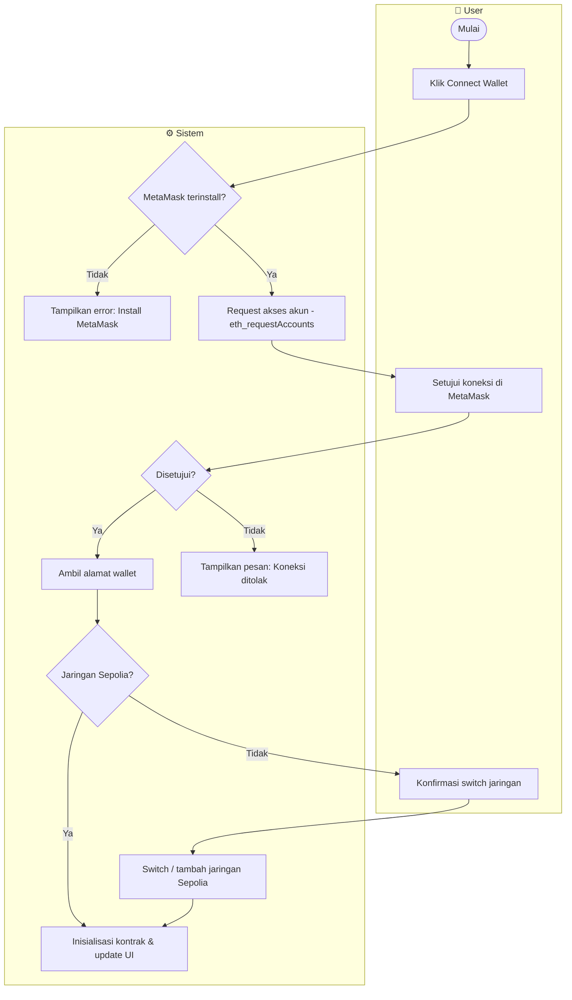
```mermaid
flowchart TD
    subgraph System["⚙️ Sistem"]
        C{MetaMask terinstall?}
        D[Tampilkan error: Install MetaMask]
        E[Request akses akun - eth_requestAccounts]
        G{Disetujui?}
        H[Ambil alamat wallet]
        I{Jaringan Sepolia?}
        K[Switch / tambah jaringan Sepolia]
        L[Inisialisasi kontrak & update UI]
        M[Tampilkan pesan: Koneksi ditolak]
    end

    subgraph User["👤 User"]
        A([Mulai])
        B[Klik Connect Wallet]
        F[Setujui koneksi di MetaMask]
        J[Konfirmasi switch jaringan]
    end

    A --> B --> C
    C -- Tidak --> D
    C -- Ya --> E --> F --> G
    G -- Tidak --> M
    G -- Ya --> H --> I
    I -- Ya --> L
    I -- Tidak --> J --> K --> L
```

### Sequence Diagram

> **[Paragraf Pengantar untuk Word]**
> Rincian teknis interaksi antar komponen saat menghubungkan *wallet* dapat dilihat pada *Sequence Diagram* di **Gambar [Nomor Gambar]**. Diagram mendemonstrasikan panggilan fungsi dari *frontend* ke ekstensi MetaMask untuk mendapatkan akses akun.

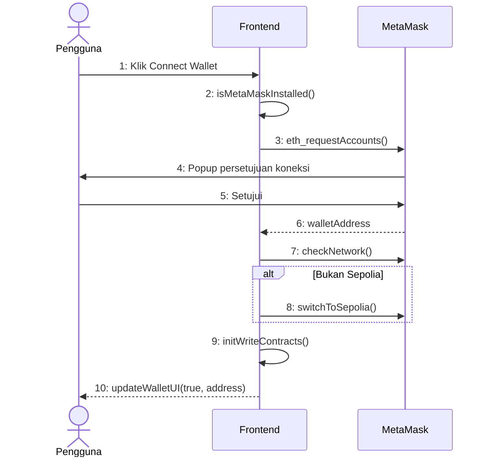
```mermaid
sequenceDiagram
    actor User as Pengguna
    participant FE as Frontend
    participant MM as MetaMask

    User->>FE: 1: Klik Connect Wallet
    FE->>FE: 2: isMetaMaskInstalled()
    FE->>MM: 3: eth_requestAccounts()
    MM->>User: 4: Popup persetujuan koneksi
    User->>MM: 5: Setujui
    MM-->>FE: 6: walletAddress
    FE->>MM: 7: checkNetwork()
    alt Bukan Sepolia
        FE->>MM: 8: switchToSepolia()
    end
    FE->>FE: 9: initWriteContracts()
    FE-->>User: 10: updateWalletUI(true, address)
```

#### Tabel Message (Visual Paradigm)

| No | Dari | Ke | Message | Tipe |
|----|------|-----|---------|------|
| 1 | Pengguna | Frontend | Klik Connect Wallet | Synchronous |
| 2 | Frontend | Frontend | isMetaMaskInstalled() | Self |
| 3 | Frontend | MetaMask | eth_requestAccounts() | Synchronous |
| 4 | MetaMask | Pengguna | Popup persetujuan koneksi | Synchronous |
| 5 | Pengguna | MetaMask | Setujui | Synchronous |
| 6 | MetaMask | Frontend | walletAddress | Reply |
| 7 | Frontend | MetaMask | checkNetwork() | Synchronous |
| 8 | Frontend | MetaMask | switchToSepolia() *(alt: bukan Sepolia)* | Synchronous |
| 9 | Frontend | Frontend | initWriteContracts() | Self |
| 10 | Frontend | Pengguna | updateWalletUI(true, address) | Reply |

---

## 2. Membuat Kampanye

### Activity Diagram

> **[Paragraf Pengantar untuk Word]**
> Proses penggalangan dana baru oleh admin dijelaskan pada *Activity Diagram* di **Gambar [Nomor Gambar]**. Proses ini mencakup validasi data, pengunggahan gambar ke *IPFS*, hingga persetujuan transaksi di *smart contract*.

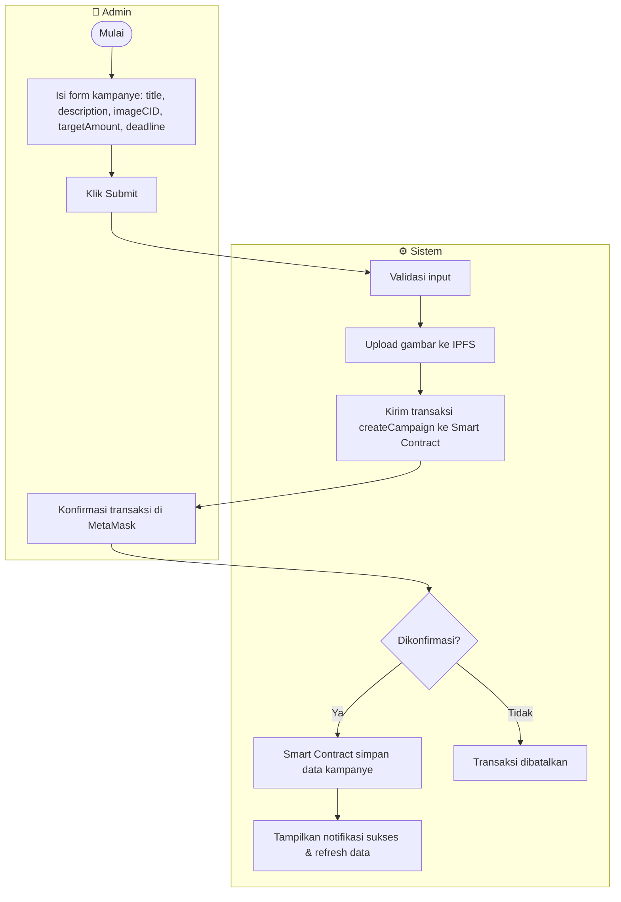
```mermaid
flowchart TD
    subgraph System["⚙️ Sistem"]
        D[Validasi input]
        E[Upload gambar ke IPFS]
        F[Kirim transaksi createCampaign ke Smart Contract]
        H{Dikonfirmasi?}
        I[Smart Contract simpan data kampanye]
        J[Tampilkan notifikasi sukses & refresh data]
        K[Transaksi dibatalkan]
    end

    subgraph User["👤 Admin"]
        A([Mulai])
        B[Isi form kampanye: title, description, imageCID, targetAmount, deadline]
        C[Klik Submit]
        G[Konfirmasi transaksi di MetaMask]
    end

    A --> B --> C --> D --> E --> F --> G --> H
    H -- Ya --> I --> J
    H -- Tidak --> K
```

### Sequence Diagram

> **[Paragraf Pengantar untuk Word]**
> Detail komunikasi antar fungsi saat pembuatan kampanye baru disajikan dalam *Sequence Diagram* pada **Gambar [Nomor Gambar]**. Diagram ini memperlihatkan secara jelas proses unggah data *off-chain* ke Pinata IPFS yang kemudian CID-nya dikirimkan ke *smart contract*.

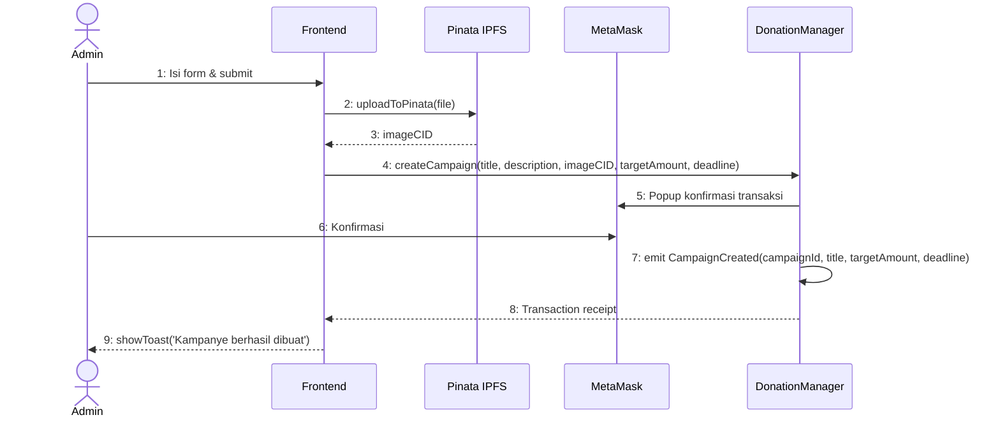
```mermaid
sequenceDiagram
    actor Admin
    participant FE as Frontend
    participant IPFS as Pinata IPFS
    participant MM as MetaMask
    participant SC as DonationManager

    Admin->>FE: 1: Isi form & submit
    FE->>IPFS: 2: uploadToPinata(file)
    IPFS-->>FE: 3: imageCID
    FE->>SC: 4: createCampaign(title, description, imageCID, targetAmount, deadline)
    SC->>MM: 5: Popup konfirmasi transaksi
    Admin->>MM: 6: Konfirmasi
    SC->>SC: 7: emit CampaignCreated(campaignId, title, targetAmount, deadline)
    SC-->>FE: 8: Transaction receipt
    FE-->>Admin: 9: showToast('Kampanye berhasil dibuat')
```

#### Tabel Message (Visual Paradigm)

| No | Dari | Ke | Message | Tipe |
|----|------|-----|---------|------|
| 1 | Admin | Frontend | Isi form & submit | Synchronous |
| 2 | Frontend | Pinata IPFS | uploadToPinata(file) | Synchronous |
| 3 | Pinata IPFS | Frontend | imageCID | Reply |
| 4 | Frontend | DonationManager | createCampaign(title, description, imageCID, targetAmount, deadline) | Synchronous |
| 5 | DonationManager | MetaMask | Popup konfirmasi transaksi | Synchronous |
| 6 | Admin | MetaMask | Konfirmasi | Synchronous |
| 7 | DonationManager | DonationManager | emit CampaignCreated(campaignId, title, targetAmount, deadline) | Self |
| 8 | DonationManager | Frontend | Transaction receipt | Reply |
| 9 | Frontend | Admin | showToast('Kampanye berhasil dibuat') | Reply |

---

## 3. Melihat Daftar Kampanye

### Activity Diagram

> **[Paragraf Pengantar untuk Word]**
> Alur sistem dalam menampilkan seluruh daftar kampanye yang tersedia dapat dilihat pada *Activity Diagram* di **Gambar [Nomor Gambar]**. Sistem akan mengambil data dari *blockchain* lalu memformatnya untuk dirender ke dalam bentuk kartu kampanye.

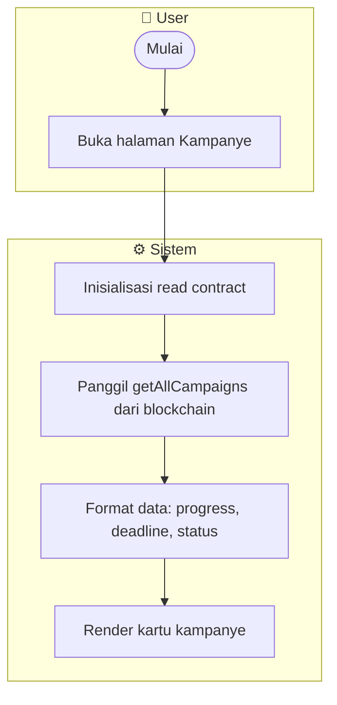
```mermaid
flowchart TD
    subgraph System["⚙️ Sistem"]
        C[Inisialisasi read contract]
        D[Panggil getAllCampaigns dari blockchain]
        E[Format data: progress, deadline, status]
        F[Render kartu kampanye]
    end

    subgraph User["👤 User"]
        A([Mulai])
        B[Buka halaman Kampanye]
    end

    A --> B --> C --> D --> E --> F
```

### Sequence Diagram

> **[Paragraf Pengantar untuk Word]**
> Pemanggilan fungsi teknis dalam memuat daftar kampanye digambarkan pada *Sequence Diagram* di **Gambar [Nomor Gambar]**. Objek *frontend* melakukan interaksi pembacaan (*read*) ke *smart contract* dan memproses datanya ke antarmuka pengguna.

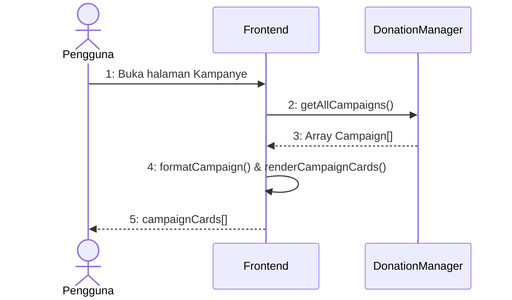
```mermaid
sequenceDiagram
    actor User as Pengguna
    participant FE as Frontend
    participant SC as DonationManager

    User->>FE: 1: Buka halaman Kampanye
    FE->>SC: 2: getAllCampaigns()
    SC-->>FE: 3: Array Campaign[]
    FE->>FE: 4: formatCampaign() & renderCampaignCards()
    FE-->>User: 5: campaignCards[]
```

#### Tabel Message (Visual Paradigm)

| No | Dari | Ke | Message | Tipe |
|----|------|-----|---------|------|
| 1 | Pengguna | Frontend | Buka halaman Kampanye | Synchronous |
| 2 | Frontend | DonationManager | getAllCampaigns() | Synchronous |
| 3 | DonationManager | Frontend | Array Campaign[] | Reply |
| 4 | Frontend | Frontend | formatCampaign() & renderCampaignCards() | Self |
| 5 | Frontend | Pengguna | campaignCards[] | Reply |

---

## 4. Melakukan Donasi

### Activity Diagram

> **[Paragraf Pengantar untuk Word]**
> Alur pelaksanaan donasi oleh pengguna diilustrasikan melalui *Activity Diagram* pada **Gambar [Nomor Gambar]**. Proses ini mencakup validasi nominal ETH pengguna dan pencetakan (*minting*) sertifikat NFT secara otomatis jika melampaui batas minimal.

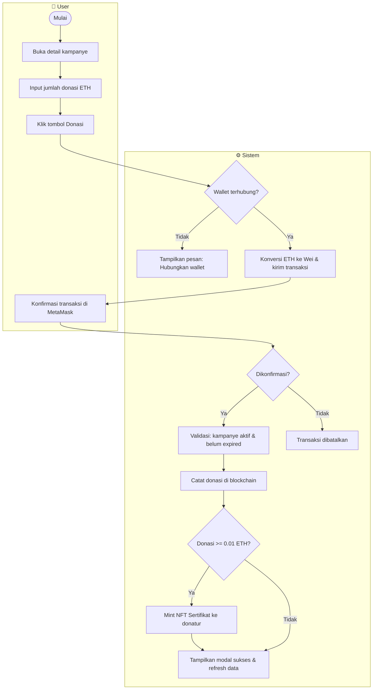
```mermaid
flowchart TD
    subgraph System["⚙️ Sistem"]
        E{Wallet terhubung?}
        E2[Tampilkan pesan: Hubungkan wallet]
        F[Konversi ETH ke Wei & kirim transaksi]
        H{Dikonfirmasi?}
        I[Validasi: kampanye aktif & belum expired]
        J[Catat donasi di blockchain]
        K{Donasi >= 0.01 ETH?}
        L[Mint NFT Sertifikat ke donatur]
        M[Tampilkan modal sukses & refresh data]
        N[Transaksi dibatalkan]
    end

    subgraph User["👤 User"]
        A([Mulai])
        B[Buka detail kampanye]
        C[Input jumlah donasi ETH]
        D[Klik tombol Donasi]
        G[Konfirmasi transaksi di MetaMask]
    end

    A --> B --> C --> D --> E
    E -- Tidak --> E2
    E -- Ya --> F --> G --> H
    H -- Tidak --> N
    H -- Ya --> I --> J --> K
    K -- Ya --> L --> M
    K -- Tidak --> M
```

### Sequence Diagram

> **[Paragraf Pengantar untuk Word]**
> Rincian teknis saat donasi dilakukan dapat dilihat pada *Sequence Diagram* di **Gambar [Nomor Gambar]**. Diagram menunjukkan alur perpindahan dana beserta eksekusi fungsi pencetakan NFT lintas-kontrak secara internal di *smart contract*.

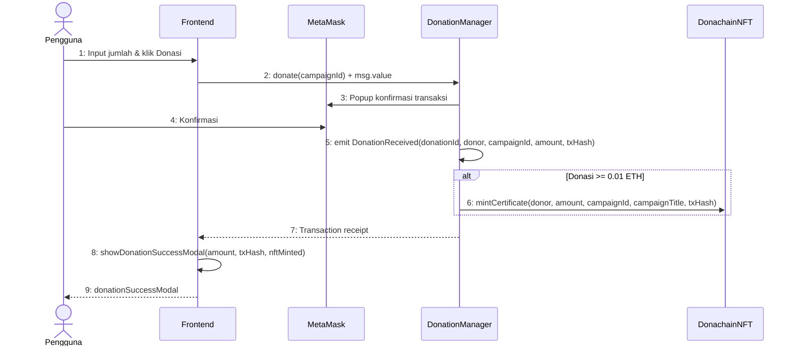
```mermaid
sequenceDiagram
    actor User as Pengguna
    participant FE as Frontend
    participant MM as MetaMask
    participant DM as DonationManager
    participant NFT as DonachainNFT

    User->>FE: 1: Input jumlah & klik Donasi
    FE->>DM: 2: donate(campaignId) + msg.value
    DM->>MM: 3: Popup konfirmasi transaksi
    User->>MM: 4: Konfirmasi
    DM->>DM: 5: emit DonationReceived(donationId, donor, campaignId, amount, txHash)
    alt Donasi >= 0.01 ETH
        DM->>NFT: 6: mintCertificate(donor, amount, campaignId, campaignTitle, txHash)
    end
    DM-->>FE: 7: Transaction receipt
    FE->>FE: 8: showDonationSuccessModal(amount, txHash, nftMinted)
    FE-->>User: 9: donationSuccessModal
```

#### Tabel Message (Visual Paradigm)

| No | Dari | Ke | Message | Tipe |
|----|------|-----|---------|------|
| 1 | Pengguna | Frontend | Input jumlah & klik Donasi | Synchronous |
| 2 | Frontend | DonationManager | donate(campaignId) + msg.value | Synchronous |
| 3 | DonationManager | MetaMask | Popup konfirmasi transaksi | Synchronous |
| 4 | Pengguna | MetaMask | Konfirmasi | Synchronous |
| 5 | DonationManager | DonationManager | emit DonationReceived(donationId, donor, campaignId, amount, txHash) | Self |
| 6 | DonationManager | DonachainNFT | mintCertificate(donor, amount, campaignId, campaignTitle, txHash) *(alt: >= 0.01 ETH)* | Synchronous |
| 7 | DonationManager | Frontend | Transaction receipt | Reply |
| 8 | Frontend | Frontend | showDonationSuccessModal(amount, txHash, nftMinted) | Self |
| 9 | Frontend | Pengguna | donationSuccessModal | Reply |

---

## 5. Melakukan Voting

### Activity Diagram

> **[Paragraf Pengantar untuk Word]**
> Mekanisme pemungutan suara (voting) menggunakan kepemilikan NFT dijelaskan melalui *Activity Diagram* pada **Gambar [Nomor Gambar]**. Alur ini memvalidasi kepemilikan token dari pengguna sebelum mencatat suara ke dalam *smart contract*.

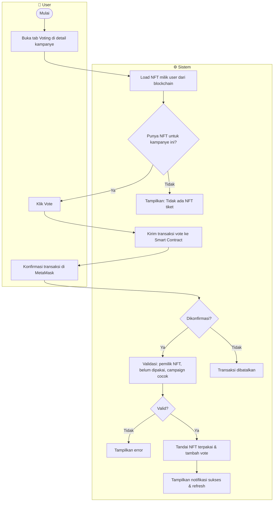
```mermaid
flowchart TD
    subgraph System["⚙️ Sistem"]
        C[Load NFT milik user dari blockchain]
        D{Punya NFT untuk kampanye ini?}
        D2[Tampilkan: Tidak ada NFT tiket]
        F[Kirim transaksi vote ke Smart Contract]
        G{Dikonfirmasi?}
        I[Validasi: pemilik NFT, belum dipakai, campaign cocok]
        J{Valid?}
        J2[Tampilkan error]
        K[Tandai NFT terpakai & tambah vote]
        L[Tampilkan notifikasi sukses & refresh]
        M[Transaksi dibatalkan]
    end

        subgraph User["👤 User"]
        A([Mulai])
        B[Buka tab Voting di detail kampanye]
        E[Klik Vote]
        H[Konfirmasi transaksi di MetaMask]
    end

    A --> B --> C --> D
    D -- Tidak --> D2
    D -- Ya --> E --> F --> H --> G
    G -- Tidak --> M
    G -- Ya --> I --> J
    J -- Tidak --> J2
    J -- Ya --> K --> L
```

### Sequence Diagram

> **[Paragraf Pengantar untuk Word]**
> Interaksi pemanggilan antar objek dalam proses *voting* dijabarkan pada *Sequence Diagram* di **Gambar [Nomor Gambar]**. Diagram ini mendemonstrasikan interaksi kontraktual antara komponen pencatatan suara (*Voting*) dengan komponen pembaca token (*DonachainNFT*).

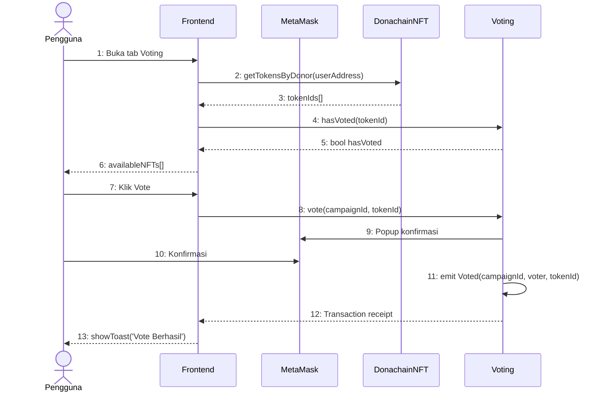
```mermaid
sequenceDiagram
    actor User as Pengguna
    participant FE as Frontend
    participant MM as MetaMask
    participant NFT as DonachainNFT
    participant VC as Voting

    User->>FE: 1: Buka tab Voting
    FE->>NFT: 2: getTokensByDonor(userAddress)
    NFT-->>FE: 3: tokenIds[]
    FE->>VC: 4: hasVoted(tokenId)
    VC-->>FE: 5: bool hasVoted
    FE-->>User: 6: availableNFTs[]

    User->>FE: 7: Klik Vote
    FE->>VC: 8: vote(campaignId, tokenId)
    VC->>MM: 9: Popup konfirmasi
    User->>MM: 10: Konfirmasi
    VC->>VC: 11: emit Voted(campaignId, voter, tokenId)
    VC-->>FE: 12: Transaction receipt
    FE-->>User: 13: showToast('Vote Berhasil')
```

#### Tabel Message (Visual Paradigm)

| No | Dari | Ke | Message | Tipe |
|----|------|-----|---------|------|
| 1 | Pengguna | Frontend | Buka tab Voting | Synchronous |
| 2 | Frontend | DonachainNFT | getTokensByDonor(userAddress) | Synchronous |
| 3 | DonachainNFT | Frontend | tokenIds[] | Reply |
| 4 | Frontend | Voting | hasVoted(tokenId) | Synchronous |
| 5 | Voting | Frontend | bool hasVoted | Reply |
| 6 | Frontend | Pengguna | availableNFTs[] | Reply |
| 7 | Pengguna | Frontend | Klik Vote | Synchronous |
| 8 | Frontend | Voting | vote(campaignId, tokenId) | Synchronous |
| 9 | Voting | MetaMask | Popup konfirmasi | Synchronous |
| 10 | Pengguna | MetaMask | Konfirmasi | Synchronous |
| 11 | Voting | Voting | emit Voted(campaignId, voter, tokenId) | Self |
| 12 | Voting | Frontend | Transaction receipt | Reply |
| 13 | Frontend | Pengguna | showToast('Vote Berhasil') | Reply |

---

## 6. Menyalurkan Dana

### Activity Diagram

> **[Paragraf Pengantar untuk Word]**
> Alur penyaluran dana kampanye oleh admin digambarkan pada *Activity Diagram* di **Gambar [Nomor Gambar]**. Proses memvalidasi ketersediaan saldo sebelum ETH dikirimkan ke pihak penerima dan dicatat sebagai pengeluaran (*expense*).

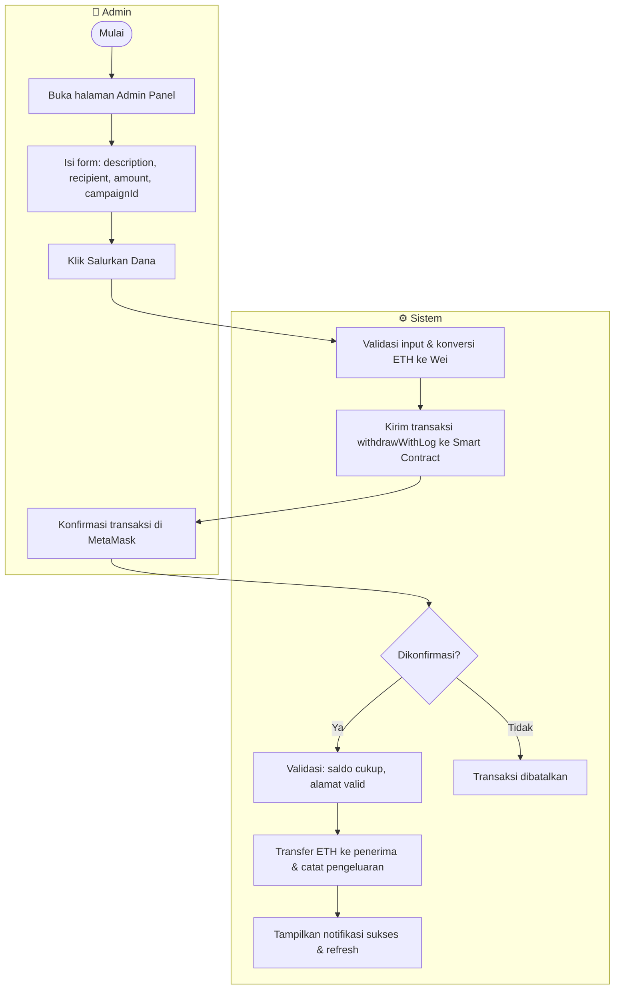
```mermaid
flowchart TD
    subgraph System["⚙️ Sistem"]
        E[Validasi input & konversi ETH ke Wei]
        F[Kirim transaksi withdrawWithLog ke Smart Contract]
        H{Dikonfirmasi?}
        I[Validasi: saldo cukup, alamat valid]
        J[Transfer ETH ke penerima & catat pengeluaran]
        K[Tampilkan notifikasi sukses & refresh]
        L[Transaksi dibatalkan]
    end

    subgraph User["👤 Admin"]
        A([Mulai])
        B[Buka halaman Admin Panel]
        C[Isi form: description, recipient, amount, campaignId]
        D[Klik Salurkan Dana]
        G[Konfirmasi transaksi di MetaMask]
    end

    A --> B --> C --> D --> E --> F --> G --> H
    H -- Tidak --> L
    H -- Ya --> I --> J --> K
```

### Sequence Diagram

> **[Paragraf Pengantar untuk Word]**
> Pemanggilan fungsi penarikan dana dapat dilihat rinciannya pada *Sequence Diagram* di **Gambar [Nomor Gambar]**. Diagram membuktikan peran komponen *frontend* dalam mengirimkan detail alamat target serta jumlah dana ke fungsi eksekutor di *blockchain*.

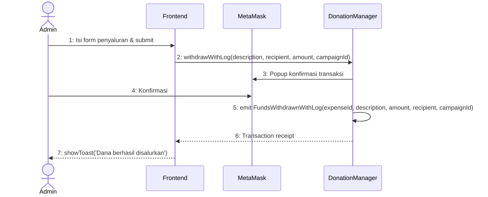
```mermaid
sequenceDiagram
    actor Admin
    participant FE as Frontend
    participant MM as MetaMask
    participant DM as DonationManager

    Admin->>FE: 1: Isi form penyaluran & submit
    FE->>DM: 2: withdrawWithLog(description, recipient, amount, campaignId)
    DM->>MM: 3: Popup konfirmasi transaksi
    Admin->>MM: 4: Konfirmasi
    DM->>DM: 5: emit FundsWithdrawnWithLog(expenseId, description, amount, recipient, campaignId)
    DM-->>FE: 6: Transaction receipt
    FE-->>Admin: 7: showToast('Dana berhasil disalurkan')
```

#### Tabel Message (Visual Paradigm)

| No | Dari | Ke | Message | Tipe |
|----|------|-----|---------|------|
| 1 | Admin | Frontend | Isi form penyaluran & submit | Synchronous |
| 2 | Frontend | DonationManager | withdrawWithLog(description, recipient, amount, campaignId) | Synchronous |
| 3 | DonationManager | MetaMask | Popup konfirmasi transaksi | Synchronous |
| 4 | Admin | MetaMask | Konfirmasi | Synchronous |
| 5 | DonationManager | DonationManager | emit FundsWithdrawnWithLog(expenseId, description, amount, recipient, campaignId) | Self |
| 6 | DonationManager | Frontend | Transaction receipt | Reply |
| 7 | Frontend | Admin | showToast('Dana berhasil disalurkan') | Reply |

---

## 7. Melihat Riwayat Donasi

### Activity Diagram

> **[Paragraf Pengantar untuk Word]**
> Alur sistem untuk membentuk halaman transparansi dijelaskan pada *Activity Diagram* di **Gambar [Nomor Gambar]**. Sistem akan mengambil seluruh data historis donasi beserta informasi kampanye terkait untuk disajikan dalam bentuk tabel.

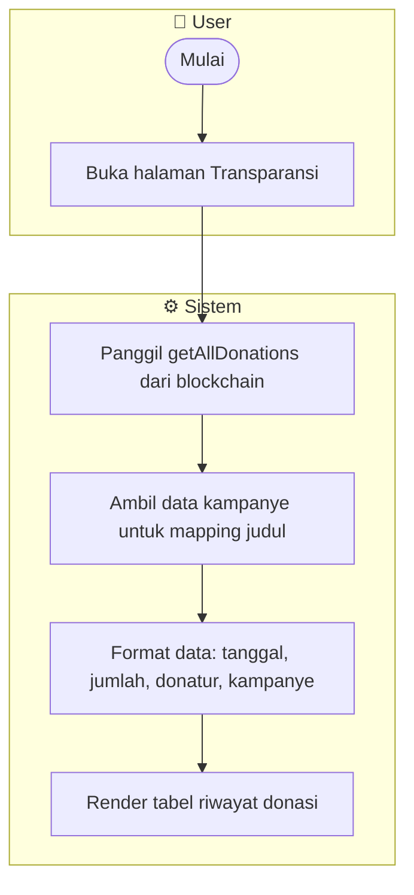
```mermaid
flowchart TD
    subgraph System["⚙️ Sistem"]
        C[Panggil getAllDonations dari blockchain]
        D[Ambil data kampanye untuk mapping judul]
        E[Format data: tanggal, jumlah, donatur, kampanye]
        F[Render tabel riwayat donasi]
    end

    subgraph User["👤 User"]
        A([Mulai])
        B[Buka halaman Transparansi]
    end

    A --> B --> C --> D --> E --> F
```

### Sequence Diagram

> **[Paragraf Pengantar untuk Word]**
> Interaksi teknis untuk mengambil informasi riwayat dijabarkan dalam *Sequence Diagram* pada **Gambar [Nomor Gambar]**. Diagram ini menunjukkan bagaimana dua set (array data) berbeda dari *smart contract* dikumpulkan sebelum di-*render* ke desain antarmuka.

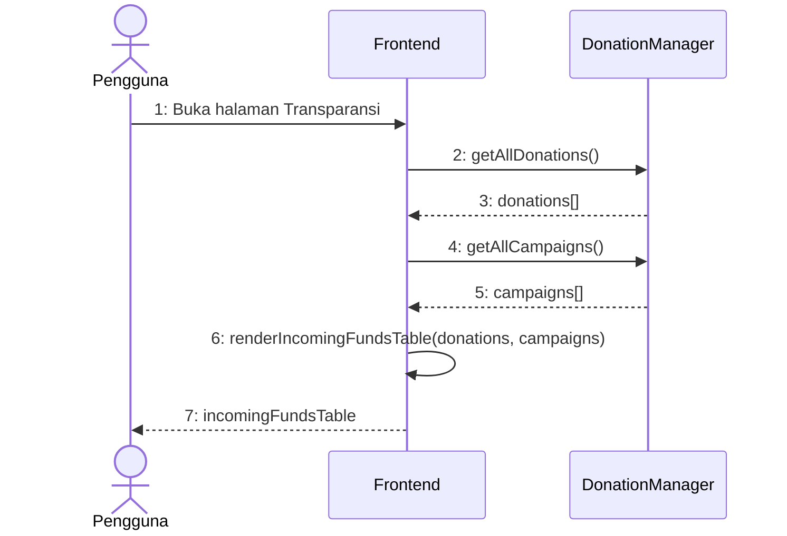
```mermaid
sequenceDiagram
    actor User as Pengguna
    participant FE as Frontend
    participant DM as DonationManager

    User->>FE: 1: Buka halaman Transparansi
    FE->>DM: 2: getAllDonations()
    DM-->>FE: 3: donations[]
    FE->>DM: 4: getAllCampaigns()
    DM-->>FE: 5: campaigns[]
    FE->>FE: 6: renderIncomingFundsTable(donations, campaigns)
    FE-->>User: 7: incomingFundsTable
```

#### Tabel Message (Visual Paradigm)

| No | Dari | Ke | Message | Tipe |
|----|------|-----|---------|------|
| 1 | Pengguna | Frontend | Buka halaman Transparansi | Synchronous |
| 2 | Frontend | DonationManager | getAllDonations() | Synchronous |
| 3 | DonationManager | Frontend | donations[] | Reply |
| 4 | Frontend | DonationManager | getAllCampaigns() | Synchronous |
| 5 | DonationManager | Frontend | campaigns[] | Reply |
| 6 | Frontend | Frontend | renderIncomingFundsTable(donations, campaigns) | Self |
| 7 | Frontend | Pengguna | incomingFundsTable | Reply |

---

## 8. Mengunduh Laporan CSV

### Activity Diagram

> **[Paragraf Pengantar untuk Word]**
> Proses pengunduhan bukti laporan berupa berkas disajikan melalui *Activity Diagram* di **Gambar [Nomor Gambar]**. Alur menjelaskan pemrosesan data donasi ke dalam baris dan kolom untuk menghasilkan luaran CSV.

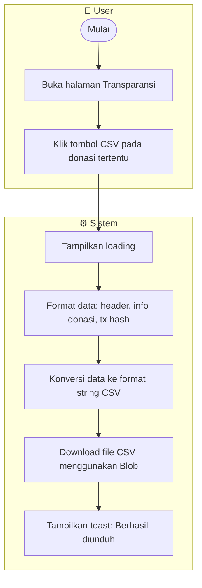
```mermaid
flowchart TD
    subgraph System["⚙️ Sistem"]
        D[Tampilkan loading]
        F[Format data: header, info donasi, tx hash]
        G[Konversi data ke format string CSV]
        H[Download file CSV menggunakan Blob]
        I[Tampilkan toast: Berhasil diunduh]
    end

    subgraph User["👤 User"]
        A([Mulai])
        B[Buka halaman Transparansi]
        C[Klik tombol CSV pada donasi tertentu]
    end

    A --> B --> C --> D --> F --> G --> H --> I
```

### Sequence Diagram

> **[Paragraf Pengantar untuk Word]**
> Detail perlakuan objek dalam mengekspor format teks datar ditunjukkan lewat *Sequence Diagram* di **Gambar [Nomor Gambar]**. Terlihat bahwa kapabilitas pengelola file ditangani secara logis memakai *Browser API* (URL.createObjectURL) di antarmuka klien tanpa interaksi layanan eksternal.

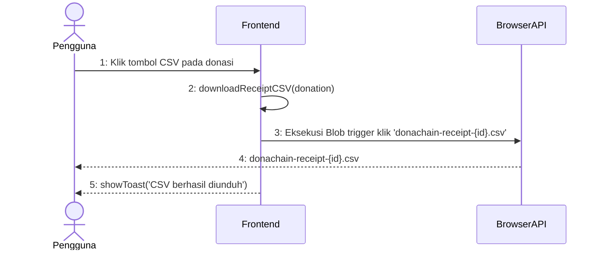
```mermaid
sequenceDiagram
    actor User as Pengguna
    participant FE as Frontend
    participant CSV as BrowserAPI

    User->>FE: 1: Klik tombol CSV pada donasi
    FE->>FE: 2: downloadReceiptCSV(donation)
    FE->>CSV: 3: Eksekusi Blob trigger klik 'donachain-receipt-{id}.csv'
    CSV-->>User: 4: donachain-receipt-{id}.csv
    FE-->>User: 5: showToast('CSV berhasil diunduh')
```

#### Tabel Message (Visual Paradigm)

| No | Dari | Ke | Message | Tipe |
|----|------|-----|---------|------|
| 1 | Pengguna | Frontend | Klik tombol CSV pada donasi | Synchronous |
| 2 | Frontend | Frontend | downloadReceiptCSV(donation) | Self |
| 3 | Frontend | BrowserAPI | Eksekusi Blob trigger klik 'donachain-receipt-{id}.csv' | Synchronous |
| 4 | BrowserAPI | Pengguna | donachain-receipt-{id}.csv | Reply |
| 5 | Frontend | Pengguna | showToast('CSV berhasil diunduh') | Reply |

---

## 9. Melihat Leaderboard

### Activity Diagram

> **[Paragraf Pengantar untuk Word]**
> Tahapan algoritma agregasi donatur dijelaskan pada *Activity Diagram* di **Gambar [Nomor Gambar]**. Sistem akan mengambil total akumulasi donasi yang didapat per individu lalu mengurutkannya dari yang tertinggi ke terendah sebagai bentuk *Leaderboard*.

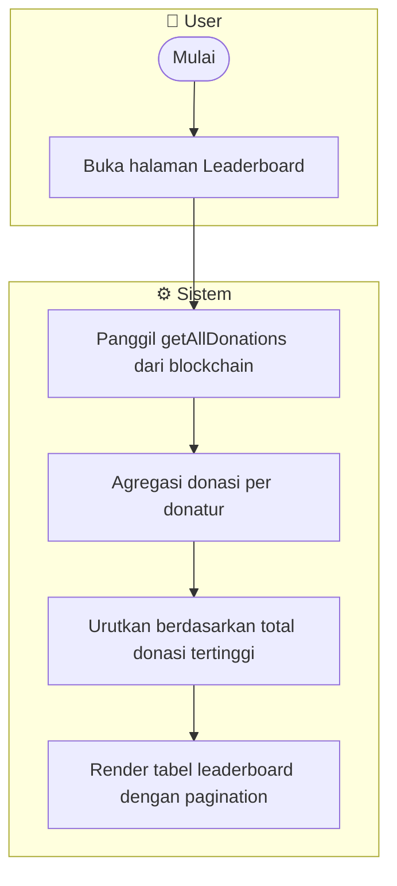
```mermaid
flowchart TD
    subgraph System["⚙️ Sistem"]
        C[Panggil getAllDonations dari blockchain]
        D[Agregasi donasi per donatur]
        E[Urutkan berdasarkan total donasi tertinggi]
        F[Render tabel leaderboard dengan pagination]
    end

    subgraph User["👤 User"]
        A([Mulai])
        B[Buka halaman Leaderboard]
    end

    A --> B --> C --> D --> E --> F
```

### Sequence Diagram

> **[Paragraf Pengantar untuk Word]**
> Aliran manipulasi data dalam membentuk tabel peringkat donatur dipaparkan pada *Sequence Diagram* di **Gambar [Nomor Gambar]**. Menariknya, terlihat bahwa penghitungan akumulasi dan pengurutan data seutuhnya terjadi efisien pada komponen *Frontend* setelah menerima semua donasi dari *smart contract*.

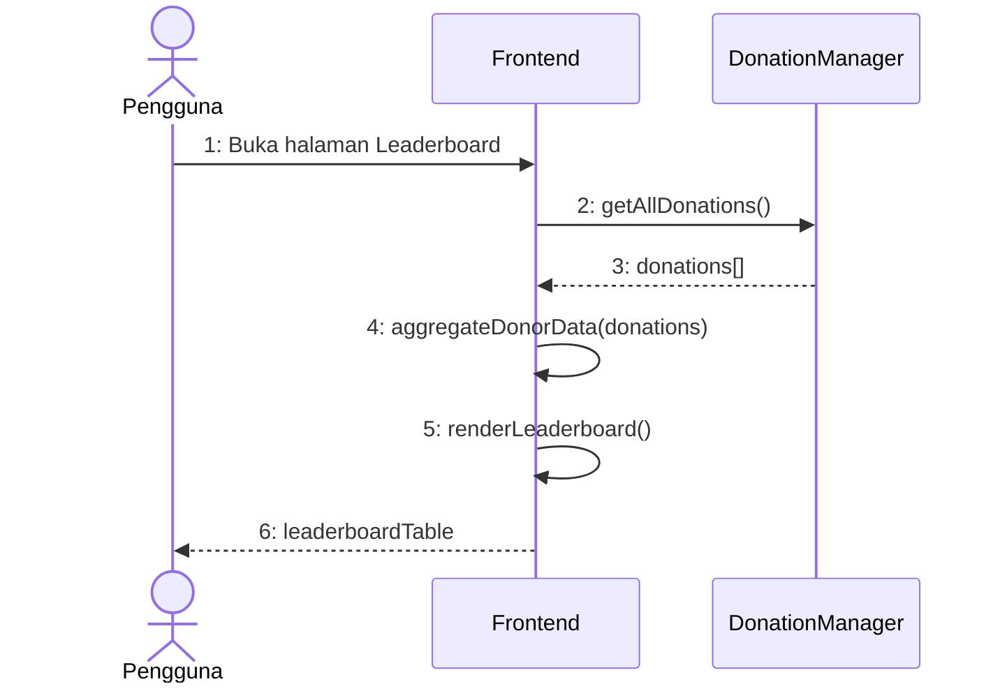
```mermaid
sequenceDiagram
    actor User as Pengguna
    participant FE as Frontend
    participant DM as DonationManager

    User->>FE: 1: Buka halaman Leaderboard
    FE->>DM: 2: getAllDonations()
    DM-->>FE: 3: donations[]
    FE->>FE: 4: aggregateDonorData(donations)
    FE->>FE: 5: renderLeaderboard()
    FE-->>User: 6: leaderboardTable
```

#### Tabel Message (Visual Paradigm)

| No | Dari | Ke | Message | Tipe |
|----|------|-----|---------|------|
| 1 | Pengguna | Frontend | Buka halaman Leaderboard | Synchronous |
| 2 | Frontend | DonationManager | getAllDonations() | Synchronous |
| 3 | DonationManager | Frontend | donations[] | Reply |
| 4 | Frontend | Frontend | aggregateDonorData(donations) | Self |
| 5 | Frontend | Frontend | renderLeaderboard() | Self |
| 6 | Frontend | Pengguna | leaderboardTable | Reply |
