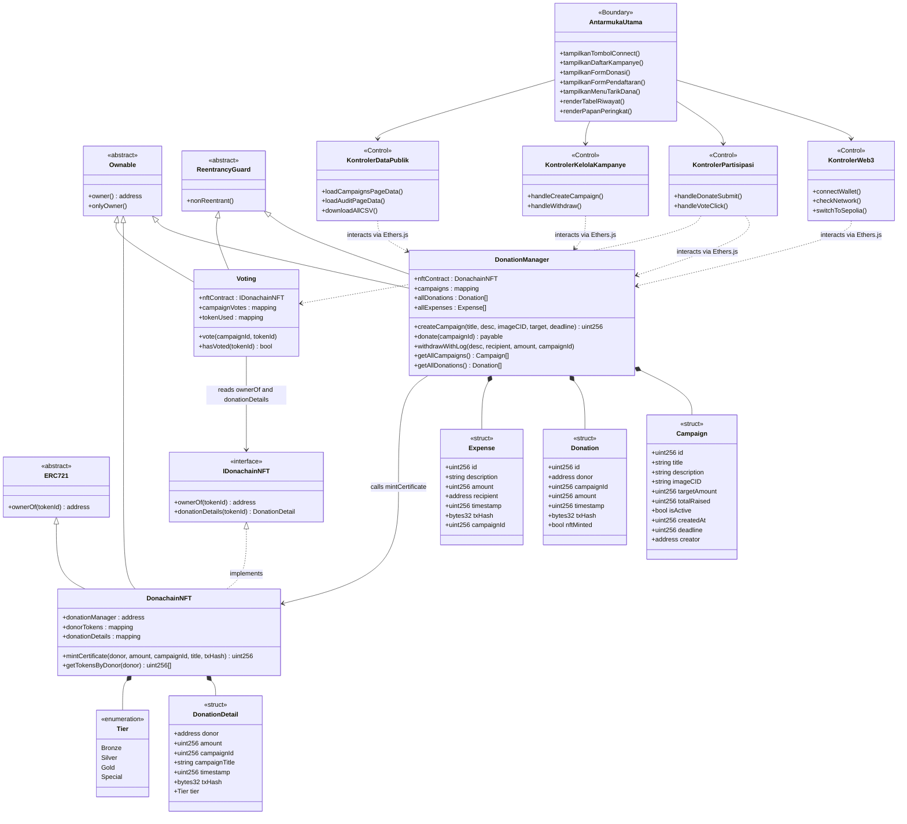
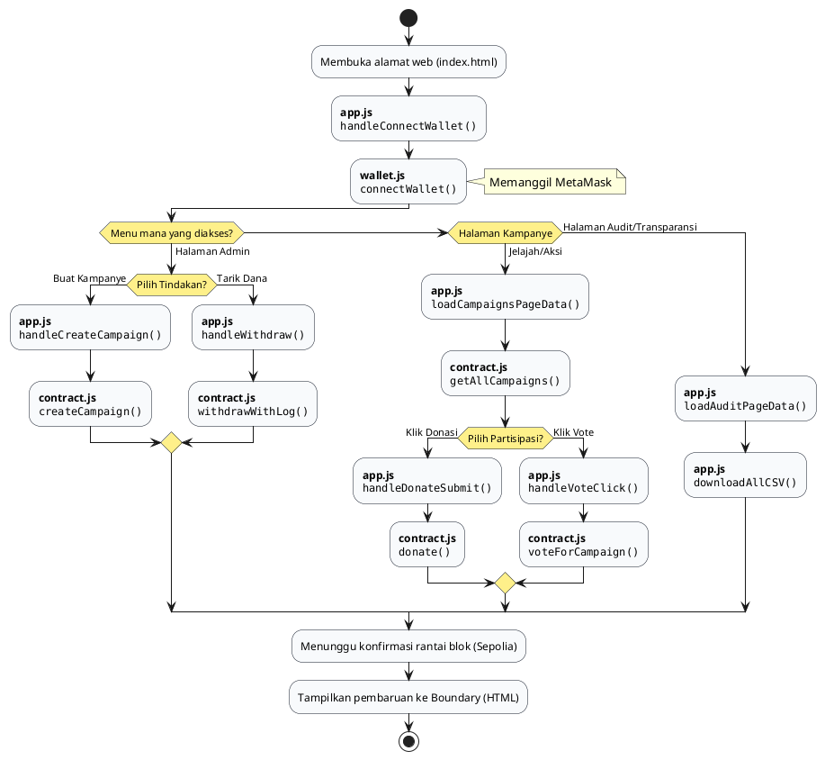
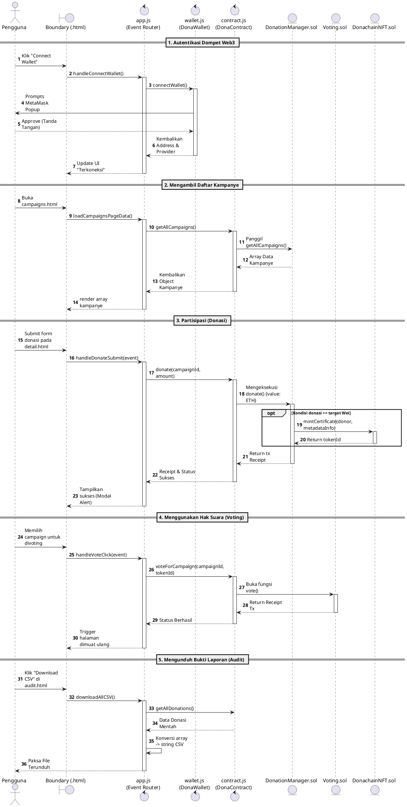

# Diagram Sistem Keseluruhan — Arsitektur BCE

Diagram di dokumen ini adalah perwujudan 100% akurat dari *source code* aslimu. Kita tidak menggunakan penamaan *Controller* palsu (seperti *AppController*). Sebaliknya, skripsimu akan menampilkan nama file HTML dan JS-mu yang sebenarnya, dikelompokkan menggunakan standarisasi **Model-View-Controller (MVC) / BCE**.

- **Boundary (View)** = File-file `.html` (Antarmuka publik)
- **Control (Controller)** = File-file `.js` (`app.js` sebagai pusat pergerakan, dibantu `wallet.js` & `contract.js`)
- **Entity (Model)** = File-file `.sol` (*Smart Contracts*)

Hanya fungsi-fungsi/variabel penting yang dipanggil di siklus utama yang dimasukkan ke kotak *Class*.

---

## 1. Class Diagram (Versi BCE — Berbasis Class Diagram Medium)

Diagram ini menggunakan fondasi visual dan kelengkapan yang sama persis dengan **Class Diagram Medium** di artifact `class_diagram.md`, namun kelas `Frontend` kini dipecah menjadi **Boundary** (kelas antarmuka) dan **Control** (kelas proses) sesuai pola BCE yang telah kita diskusikan.

---

## 2. Activity Diagram (Keseluruhan Alur dApp)

Memetakan jejak *User* sejak membuka tab *browser* hingga eksekusi akhir, menggunakan fungsi asli yang ada di dalam `app.js`.

---

## 3. Sequence Diagram (Detail Lintasan Logika Keseluruhan)

Diagram sekuensial ini meruntun eksekusi kode lapis per lapis persis seperti cara kode *Vanilla JS*-mu dirancang menjembatani HTML dengan Kontrak pintar `Solidity`.

