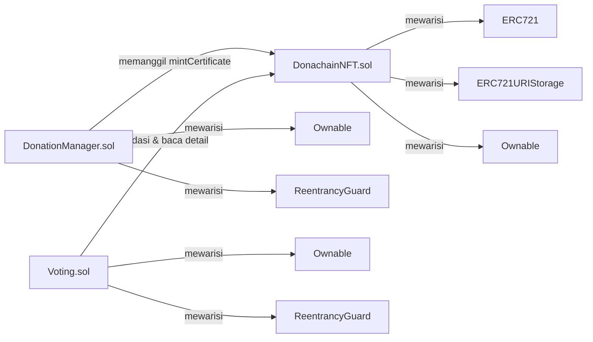

# Rancangan Smart Contract Donachain

Dokumen ini berisi rancangan struktur data dan fungsi dari smart contract **DonationManager.sol** dan **DonachainNFT.sol** pada platform Donachain.

---

## 1. Rancangan Struktur Data Smart Contract — `DonationManager.sol`

### 1.1 Enumerasi & Konstanta

| No  | Nama                   | Tipe                 | Nilai      | Keterangan                                                    |
| --- | ---------------------- | -------------------- | ---------- | ------------------------------------------------------------- |
| 1   | `MIN_DONATION_FOR_NFT` | `uint256` (constant) | 0.01 ether | Jumlah minimum donasi agar donatur mendapatkan NFT sertifikat |

### 1.2 Struct `Campaign`

| No  | Field          | Tipe Data | Keterangan                                               |
| --- | -------------- | --------- | -------------------------------------------------------- |
| 1   | `id`           | `uint256` | Identifier unik kampanye                                 |
| 2   | `title`        | `string`  | Judul kampanye (maks. 100 karakter)                      |
| 3   | `description`  | `string`  | Deskripsi lengkap kampanye                               |
| 4   | `imageCID`     | `string`  | IPFS Content ID untuk gambar kampanye                    |
| 5   | `targetAmount` | `uint256` | Target dana yang ingin dicapai (dalam wei)               |
| 6   | `totalRaised`  | `uint256` | Total dana yang sudah terkumpul (dalam wei)              |
| 7   | `isActive`     | `bool`    | Status aktif kampanye (masih menerima donasi atau tidak) |
| 8   | `createdAt`    | `uint256` | Timestamp Unix saat kampanye dibuat                      |
| 9   | `deadline`     | `uint256` | Timestamp Unix batas waktu kampanye                      |
| 10  | `creator`      | `address` | Alamat wallet pembuat kampanye (admin)                   |

### 1.3 Struct `Donation`

| No  | Field        | Tipe Data | Keterangan                                 |
| --- | ------------ | --------- | ------------------------------------------ |
| 1   | `id`         | `uint256` | Identifier unik donasi                     |
| 2   | `donor`      | `address` | Alamat wallet donatur                      |
| 3   | `campaignId` | `uint256` | ID kampanye yang menerima donasi           |
| 4   | `amount`     | `uint256` | Jumlah donasi dalam wei                    |
| 5   | `timestamp`  | `uint256` | Timestamp Unix saat donasi dilakukan       |
| 6   | `txHash`     | `bytes32` | Hash transaksi sebagai bukti donasi        |
| 7   | `nftMinted`  | `bool`    | Status apakah NFT sertifikat sudah dicetak |

### 1.4 Struct `Expense`

| No  | Field         | Tipe Data | Keterangan                                 |
| --- | ------------- | --------- | ------------------------------------------ |
| 1   | `id`          | `uint256` | Identifier unik pengeluaran                |
| 2   | `description` | `string`  | Deskripsi tujuan pengeluaran               |
| 3   | `amount`      | `uint256` | Jumlah dana yang dikeluarkan (dalam wei)   |
| 4   | `recipient`   | `address` | Alamat penerima dana                       |
| 5   | `timestamp`   | `uint256` | Timestamp Unix saat penarikan dilakukan    |
| 6   | `txHash`      | `bytes32` | Hash transaksi penarikan                   |
| 7   | `campaignId`  | `uint256` | ID kampanye terkait (0 jika bersifat umum) |

### 1.5 State Variables & Mappings

| No  | Nama                     | Tipe Data                      | Keterangan                                            |
| --- | ------------------------ | ------------------------------ | ----------------------------------------------------- |
| 1   | `campaigns`              | `mapping(uint256 => Campaign)` | Penyimpanan data utama untuk seluruh kampanye         |
| 2   | `allDonations`           | `Donation[]`                   | Daftar seluruh riwayat donasi yang masuk              |
| 3   | `allExpenses`            | `Expense[]`                    | Daftar seluruh riwayat pengeluaran dana               |
| 4   | `donorTotalAmount`       | `mapping(address => uint256)`  | Akumulasi total donasi per alamat (untuk leaderboard) |
| 5   | `totalDonationsReceived` | `uint256`                      | Total seluruh dana masuk di platform                  |
| 6   | `totalExpensesLogged`    | `uint256`                      | Total seluruh dana yang telah disalurkan/dikeluarkan  |
| 7   | `nftContract`            | `DonachainNFT`                 | Alamat kontrak NFT yang terintegrasi                  |

---

## 2. Rancangan Fungsi Smart Contract — `DonationManager.sol`

| No  | Nama Fungsi            | Akses                               | Parameter Input                                                                                          | Deskripsi Logika                                                                    |
| --- | ---------------------- | ----------------------------------- | -------------------------------------------------------------------------------------------------------- | ----------------------------------------------------------------------------------- |
| 1   | `createCampaign`       | Admin (`onlyOwner`)                 | `title: string`, `description: string`, `imageCID: string`, `targetAmount: uint256`, `deadline: uint256` | Membuat kampanye donasi baru dengan validasi input dan menyimpannya ke storage      |
| 2   | `donate`               | Publik (`payable`, `nonReentrant`)  | `campaignId: uint256`                                                                                    | Menerima donasi ETH, mencatat ke storage, dan otomatis mencetak NFT jika ≥ 0.01 ETH |
| 3   | `withdrawWithLog`      | Admin (`onlyOwner`, `nonReentrant`) | `description: string`, `recipient: address payable`, `amount: uint256`, `campaignId: uint256`            | Menarik dana dari kontrak sekaligus mencatat pengeluaran untuk transparansi         |
| 4   | `updateCampaignStatus` | Admin (`onlyOwner`)                 | `campaignId: uint256`, `isActive: bool`                                                                  | Mengubah status aktif/non-aktif suatu kampanye                                      |
| 5   | `getAllCampaigns`      | Publik (view)                       | —                                                                                                        | Mengambil seluruh data kampanye                                                     |
| 6   | `getActiveCampaigns`   | Publik (view)                       | —                                                                                                        | Mengembalikan kampanye yang masih aktif dan belum melewati deadline                 |
| 7   | `getAllDonations`      | Publik (view)                       | —                                                                                                        | Mengembalikan seluruh catatan donasi                                                |
| 8   | `getAllExpenses`       | Publik (view)                       | —                                                                                                        | Mengembalikan seluruh catatan pengeluaran                                           |
| 9   | `getLeaderboard`       | Publik (view)                       | `count: uint256`                                                                                         | Mengambil daftar top donatur                                                        |
| 10  | `getStats`             | Publik (view)                       | —                                                                                                        | Mengembalikan ringkasan statistik platform                                          |

---

## 3. Rancangan Struktur Data Smart Contract NFT — `DonachainNFT.sol`

### 3.1 Enumerasi & Konstanta

| No  | Nama               | Tipe                 | Nilai                                 | Keterangan                                        |
| --- | ------------------ | -------------------- | ------------------------------------- | ------------------------------------------------- |
| 1   | `Tier`             | `enum`               | `Bronze`, `Silver`, `Gold`, `Special` | Enumerasi tingkatan tier sertifikat NFT           |
| 2   | `SILVER_THRESHOLD` | `uint256` (constant) | 0.05 ether                            | Batas minimum donasi untuk mendapat tier Silver   |
| 3   | `GOLD_THRESHOLD`   | `uint256` (constant) | 0.1 ether                             | Batas minimum donasi untuk mendapat tier Gold     |
| 4   | `SPECIAL_CHANCE`   | `uint256` (constant) | 500 (5% dari 10000)                   | Probabilitas mendapatkan tier Special secara acak |
| 5   | `BRONZE_CID`       | `string` (constant)  | `bafybei...`                          | IPFS CID gambar untuk tier Bronze                 |
| 6   | `SILVER_CID`       | `string` (constant)  | `bafkrei...`                          | IPFS CID gambar untuk tier Silver                 |
| 7   | `GOLD_CID`         | `string` (constant)  | `bafybei...`                          | IPFS CID gambar untuk tier Gold                   |
| 8   | `SPECIAL_CID`      | `string` (constant)  | `bafybei...`                          | IPFS CID gambar untuk tier Special                |

### 3.2 Struct `DonationDetail`

| No  | Field           | Tipe Data | Keterangan                                            |
| --- | --------------- | --------- | ----------------------------------------------------- |
| 1   | `donor`         | `address` | Alamat wallet donatur pemilik NFT                     |
| 2   | `amount`        | `uint256` | Jumlah donasi dalam wei yang memicu pencetakan NFT    |
| 3   | `campaignId`    | `uint256` | ID kampanye yang didonasikan                          |
| 4   | `campaignTitle` | `string`  | Judul kampanye yang didonasikan                       |
| 5   | `timestamp`     | `uint256` | Timestamp Unix saat donasi dan NFT dicetak            |
| 6   | `txHash`        | `bytes32` | Hash transaksi donasi terkait                         |
| 7   | `tier`          | `Tier`    | Tingkatan tier NFT (Bronze / Silver / Gold / Special) |

### 3.3 State Variables & Mappings

| No  | Nama              | Tipe Data                            | Keterangan                                                      |
| --- | ----------------- | ------------------------------------ | --------------------------------------------------------------- |
| 1   | `_nextTokenId`    | `uint256`                            | Counter auto-increment untuk ID token NFT                       |
| 2   | `_randomNonce`    | `uint256`                            | Nonce untuk pseudo-random number generation                     |
| 3   | `donationManager` | `address`                            | Alamat kontrak DonationManager yang berwenang melakukan minting |
| 4   | `donationDetails` | `mapping(uint256 => DonationDetail)` | Pemetaan ID token ke detail donasi yang terkait                 |
| 5   | `donorTokens`     | `mapping(address => uint256[])`      | Pemetaan alamat donatur ke daftar token ID yang dimiliki        |

---

## 4. Rancangan Fungsi Smart Contract NFT — `DonachainNFT.sol`

### 4.1 Fungsi Admin (Hanya Owner)

| No  | Nama Fungsi          | Parameter                   | Return | Modifier    | Keterangan                                                                         |
| --- | -------------------- | --------------------------- | ------ | ----------- | ---------------------------------------------------------------------------------- |
| 1   | `setDonationManager` | `_donationManager: address` | —      | `onlyOwner` | Mengatur alamat kontrak DonationManager yang diizinkan untuk melakukan minting NFT |

### 4.2 Fungsi Minting

| No  | Nama Fungsi       | Akses                   | Parameter Input                                                                                        | Deskripsi Logika                                                                               |
| --- | ----------------- | ----------------------- | ------------------------------------------------------------------------------------------------------ | ---------------------------------------------------------------------------------------------- |
| 1   | `mintCertificate` | Hanya `DonationManager` | `donor: address`, `amount: uint256`, `campaignId: uint256`, `campaignTitle: string`, `txHash: bytes32` | Mencetak NFT sertifikat donasi, menentukan tier otomatis, dan menyimpan detail donasi on-chain |

### 4.3 Fungsi Internal

| No  | Nama Fungsi       | Parameter                                               | Return             | Visibilitas     | Keterangan                                                                                                                           |
| --- | ----------------- | ------------------------------------------------------- | ------------------ | --------------- | ------------------------------------------------------------------------------------------------------------------------------------ |
| 1   | `_determineTier`  | `amount: uint256`, `donor: address`, `tokenId: uint256` | `Tier`             | `internal`      | Menentukan tier NFT berdasarkan jumlah donasi dan pengecekan probabilitas acak untuk tier Special (5%)                               |
| 2   | `_generateRandom` | `donor: address`, `tokenId: uint256`                    | `uint256` (0–9999) | `internal`      | Menghasilkan bilangan pseudo-random menggunakan kombinasi `block.timestamp`, `block.prevrandao`, alamat donatur, token ID, dan nonce |
| 3   | `_formatEther`    | `weiAmount: uint256`                                    | `string`           | `internal pure` | Mengkonversi nilai wei ke format string ETH dengan 4 angka desimal                                                                   |

### 4.4 Fungsi View (Baca Data)

| No  | Nama Fungsi         | Parameter             | Return           | Keterangan                                                                                                |
| --- | ------------------- | --------------------- | ---------------- | --------------------------------------------------------------------------------------------------------- |
| 1   | `getTokensByDonor`  | `donor: address`      | `uint256[]`      | Mengembalikan semua token ID yang dimiliki oleh suatu alamat donatur                                      |
| 2   | `getDonationDetail` | `tokenId: uint256`    | `DonationDetail` | Mengembalikan detail donasi yang terkait dengan suatu token NFT                                           |
| 3   | `totalSupply`       | —                     | `uint256`        | Mengembalikan jumlah total NFT yang sudah dicetak                                                         |
| 4   | `getCIDForTier`     | `tier: Tier`          | `string`         | Mengembalikan IPFS CID gambar berdasarkan tier yang diberikan                                             |
| 5   | `getTierName`       | `tier: Tier`          | `string`         | Mengembalikan nama tier dalam bentuk string (Bronze/Silver/Gold/Special)                                  |
| 6   | `tokenURI`          | `tokenId: uint256`    | `string`         | Menghasilkan metadata JSON on-chain (Base64-encoded) berisi nama, deskripsi, gambar IPFS, dan atribut NFT |
| 7   | `supportsInterface` | `interfaceId: bytes4` | `bool`           | Override standar ERC-721 untuk mengecek kompatibilitas interface                                          |

### 4.5 Event

| No  | Nama Event               | Parameter                                                              | Keterangan                                         |
| --- | ------------------------ | ---------------------------------------------------------------------- | -------------------------------------------------- |
| 1   | `CertificateMinted`      | `donor` (indexed), `tokenId` (indexed), `amount`, `campaignId`, `tier` | Dipancarkan saat NFT sertifikat berhasil dicetak   |
| 2   | `DonationManagerUpdated` | `newManager` (indexed)                                                 | Dipancarkan saat alamat DonationManager diperbarui |

### 4.6 Modifier

| No  | Nama Modifier         | Keterangan                                                                            |
| --- | --------------------- | ------------------------------------------------------------------------------------- |
| 1   | `onlyDonationManager` | Membatasi akses fungsi hanya dari alamat kontrak DonationManager yang telah terdaftar |

---

## 5. Rancangan Struktur Data & Fungsi Smart Contract Voting — `Voting.sol`

### 5.1 State Variables & Mappings

| No  | Nama            | Tipe Data                      | Keterangan                                                      |
| --- | --------------- | ------------------------------ | --------------------------------------------------------------- |
| 1   | `nftContract`   | `IDonachainNFT`                | Interface ke kontrak NFT Donachain untuk validasi tiket voting  |
| 2   | `campaignVotes` | `mapping(uint256 => uint256)`  | Menyimpan akumulasi jumlah suara per ID kampanye                |
| 3   | `tokenUsed`     | `mapping(uint256 => bool)`     | Mencatat status penggunaan token NFT (1 NFT hanya bisa 1x vote) |

### 5.2 Rancangan Fungsi

| No  | Nama Fungsi      | Akses                  | Parameter Input                         | Deskripsi Logika                                                                                                    |
| --- | ---------------- | ---------------------- | --------------------------------------- | ------------------------------------------------------------------------------------------------------------------- |
| 1   | `vote`           | Publik (`nonReentrant`) | `campaignId: uint256`, `tokenId: uint256` | Melakukan vote dengan memvalidasi kepemilikan NFT, kecocokan campaign ID pada NFT, dan memastikan NFT belum terpakai |
| 2   | `hasVoted`       | Publik (view)          | `tokenId: uint256`                      | Mengecek apakah suatu token NFT sudah digunakan untuk voting                                                        |
| 3   | `getVotes`       | Publik (view)          | `campaignId: uint256`                   | Mengambil total suara yang terkumpul untuk kampanye tertentu                                                        |
| 4   | `setNFTContract` | Admin (`onlyOwner`)    | `_nftContract: address`                 | Mengatur ulang alamat kontrak NFT yang digunakan sebagai referensi                                                  |

### 5.3 Event & Aturan Bisnis

| No  | Nama Event             | Parameter                                  | Keterangan                                       |
| --- | ---------------------- | ------------------------------------------ | ------------------------------------------------ |
| 1   | `Voted`                | `campaignId` (idx), `voter` (idx), `tokenId` | Dipancarkan saat suara berhasil diverifikasi     |
| 2   | `NFTContractUpdated`   | `newAddress` (indexed)                     | Dipancarkan saat alamat kontrak referensi diganti |

**Aturan Utama Voting:**
1. **Tiket NFT**: Hanya pemilik NFT sertifikat Donachain yang dapat memberikan suara.
2. **Validitas Campaign**: NFT yang digunakan harus berasal dari donasi pada kampanye yang sedang di-vote (mencegah lintas-campaign voting).
3. **Single Vote**: Satu token NFT hanya berlaku untuk satu kali penggunaan suara selamanya.

---

## 6. Diagram Relasi Antar Kontrak

### Sistem Tier NFT

| Tier    | Rentang Donasi      | Probabilitas Special |
| ------- | ------------------- | -------------------- |
| Bronze  | 0.01 – 0.049 ETH    | —                    |
| Silver  | 0.05 – 0.099 ETH    | —                    |
| Gold    | ≥ 0.1 ETH           | —                    |
| Special | Semua jumlah donasi | 5% (acak)            |
